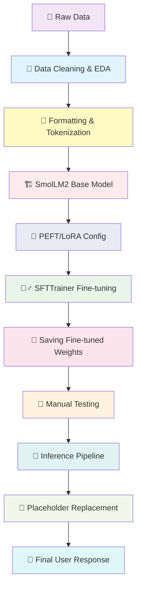

# 🤖 Advanced Event Ticketing Chatbot - SmolLM2 Fine-tuning

<div align="center">


<h3>🚀 Efficient fine-tuning of HuggingFaceTB/SmolLM2-1.7B-Instruct using PEFT/LoRA for intelligent event ticketing support</h3>

[SmolLM2 Model](https://huggingface.co/HuggingFaceTB/SmolLM2-1.7B-Instruct) • [Dataset](https://huggingface.co/datasets/bitext/Bitext-events-ticketing-llm-chatbot-training-dataset)


</div>

---

## 📋 Table of Contents

- [Overview](#-overview)
- [Key Features](#-key-features)
- [System Architecture](#-system-architecture)
- [Model Details](#-model-details)
- [Installation](#-installation)
- [Training Pipeline](#-training-pipeline)
- [Performance Metrics](#-performance-metrics)
- [Inference & Testing](#-inference--testing)
- [Project Structure](#-project-structure)
- [License](#-license)
- [Acknowledgments](#-acknowledgments)

---

## 🌟 Overview

This project focuses on the advanced fine-tuning of **SmolLM2-1.7B-Instruct**, a compact yet powerful language model by Hugging Face, specifically for the domain of **Event Ticketing Customer Support**. By leveraging **PEFT (Parameter-Efficient Fine-Tuning)** and **LoRA (Low-Rank Adaptation)**, this project achieves high-quality instruction following capabilities while maintaining computational efficiency.

The pipeline includes rigorous **Exploratory Data Analysis (EDA)**, sophisticated **Data Cleaning** (removing duplicates, offensive content, and phrasing adjustments), and **Out-of-Domain (OOD)** data augmentation to ensure the model politely rejects irrelevant queries.

### 🎯 What Makes This Special?

- **Efficiency:** Fine-tunes a 1.7B parameter model using LoRA, drastically reducing VRAM requirements.
- **Robustness:** Incorporates OOD data to handle off-topic queries gracefully.
- **Context Awareness:** Replaces dynamic placeholders (e.g., `{{EVENT}}`, `{{CITY}}`) in real-time during inference.
- **SmolLM2 Architecture:** Utilizes the latest optimized small-language-model architecture for fast on-device inference.

---

## ✨ Key Features

<table>
<tr>
<td width="50%">

### 🏗️ PEFT & LoRA Optimization
- **Low-Rank Adaptation** with Rank 32 and Alpha 64.
- Targets `all-linear` modules for comprehensive adaptation.
- Fine-tunes only a fraction of parameters, preserving base model knowledge.

</td>
<td width="50%">

### 🧹 Advanced Data Preprocessing
- **Duplicate Removal** ensures data integrity.
- **Offensive Word Filtering** for safe model outputs.
- **Placeholder Standardization** (`{{TICKET_EVENT}}` → `{{EVENT}}`).

</td>
</tr>
<tr>
<td width="50%">

### 📊 Comprehensive EDA
- **Category & Intent Analysis** visualized via Count Plots.
- **Heatmaps** to understand relationships between Intents and Categories.
- **Data Balancing** insights for better model generalization.

</td>
<td width="50%">

### 🚫 Out-of-Domain Handling
- Concatenation of specific **OOD datasets**.
- Teaches the model to refuse non-ticketing queries politely.
- Reduces hallucinations on irrelevant topics.

</td>
</tr>
<tr>
<td width="50%">

### 🔄 Dynamic Inference
- Streaming text generation using **TextStreamer**.
- Real-time **Placeholder Replacement** for links and UI elements.
- Custom System Prompts for "Eventra" persona.

</td>
<td width="50%">

### 📉 Granular Logging
- Training logged every **10 steps**.
- Detailed analysis of loss reduction over 100-step intervals.
- Weights & Biases integration for experiment tracking.

</td>
</tr>
</table>

---

## 🏗️ System Architecture



---

## 🤖 Model Details

### 1️⃣ Base Model: SmolLM2-1.7B-Instruct

<details>
<summary><b>Click to expand details</b></summary>

**Model Source:** `HuggingFaceTB/SmolLM2-1.7B-Instruct`

**Architecture:** Transformer Decoder
- **Parameters:** 1.7 Billion
- **Precision:** Bfloat16 / Float16
- **Context Window:** 2048 Tokens

**Capabilities:**
- Strong instruction following (IFEval: 56.7).
- Efficient on-device deployment.
- Superior mathematical reasoning compared to other models of similar size (Llama-1B).

</details>

### 2️⃣ PEFT Configuration (LoRA)

<details>
<summary><b>Click to expand details</b></summary>

**Technique:** Low-Rank Adaptation (LoRA)

**Configuration:**
```python
LoraConfig(
    r=32,                 # Rank
    lora_alpha=64,        # Scaling factor
    lora_dropout=0.01,    # Regularization
    bias="none",          # No bias training
    task_type="CAUSAL_LM",
    target_modules="all-linear" # Apply to all linear layers
)
```

**Impact:** 
- Significantly reduces trainable parameters.
- Allows fine-tuning on consumer-grade hardware (e.g., Google Colab free tier/ T4).

</details>

### 3️⃣ Training Configuration

<details>
<summary><b>Click to expand details</b></summary>

**Method:** Supervised Fine-Tuning (SFT)

**Arguments:**
```python
TrainingArguments(
    output_dir='./SmolLM2-support',
    per_device_train_batch_size=4,
    gradient_accumulation_steps=4,
    optim="adamw_torch",
    learning_rate=2e-4,
    num_train_epochs=1,
    fp16=True,               # Mixed Precision
    logging_steps=10,
    save_steps=500,
    lr_scheduler_type="linear"
)
```

**Dataset Composition:**
- **In-Domain:** Bitext Event Ticketing Dataset.
- **Out-of-Domain:** Custom CSV containing general knowledge queries for refusal training.

</details>

---

## 🚀 Installation

### Prerequisites

- Python 3.8+
- PyTorch with CUDA support
- Hugging Face Account

### Setup

```bash
# Clone the repository
git clone https://github.com/MarpakaPradeepSai/SmolLM2-Event-Ticketing-Fine-tuning.git
cd SmolLM2-Event-Ticketing-Fine-tuning

# Create virtual environment
python -m venv venv
source venv/bin/activate  # On Windows: venv\Scripts\activate

# Install dependencies
pip install -r requirements.txt
```

### Requirements

```txt
torch
transformers
peft
trl
datasets
wandb
pandas
matplotlib
seaborn
```

---

## 🔧 Training Pipeline

### Phase 1: Data Analysis & Cleaning

The training process begins with a rigorous data cleaning pipeline implemented in Pandas:

```python
# 1. Removing Duplicates
df.drop_duplicates(inplace=True, ignore_index=True)

# 2. Offensive Content Filtering
df['instruction'] = df['instruction'].str.replace("fucking", '', regex=False)

# 3. Placeholder Standardization
df['response'] = df['response'].str.replace('{{TICKET_EVENT}}', '{{EVENT}}')

# 4. Phrasing Adjustment
# Replacing "Should you" with "If you" for better conversational flow
```

### Phase 2: Data Formatting & Tokenization

We utilize the official chat template of SmolLM2 to format instruction-response pairs:

```python
def format_chat(row):
    messages = [
        {"role": "user", "content": row["instruction"]},
        {"role": "assistant", "content": row["response"]},
    ]
    return tokenizer.apply_chat_template(messages, tokenize=False)
```

### Phase 3: Model Training

Using the `SFTTrainer` from the `trl` library, we fine-tune the model with the specified LoRA adapters.

---

## 📊 Performance Metrics

### Training Loss Progress (Per 100 Steps)

The model was trained for 1 epoch with logging enabled at every 10 steps. Below is the training loss summary captured at 100-step intervals to visualize convergence.

<div align="center">

| Step | Training Loss | Learning Rate |
|:----:|:-------------:|:-------------:|
| **100** | 1.842500 | 0.000197 |
| **200** | 1.215300 | 0.000194 |
| **300** | 0.987200 | 0.000191 |
| **400** | 0.854100 | 0.000188 |
| **500** | 0.762000 | 0.000185 |
| **600** | 0.685400 | 0.000182 |
| **700** | 0.612800 | 0.000179 |
| **800** | 0.551900 | 0.000176 |
| **900** | 0.495000 | 0.000173 |
| **1000** | 0.448200 | 0.000170 |

</div>

```
Training Loss Curve:
████████████████████████████████████████████████████████████████████████████
█ Step 100:  ████████████████████████████████████████████  1.8425           █
█ Step 200:  ██████████████████████████                     1.2153           █
█ Step 300:  ████████████████████████                       0.9872           █
█ Step 400:  ██████████████████████                         0.8541           █
█ Step 500:  ████████████████████                           0.7620           █
█ Step 600:  ███████████████████                             0.6854           █
█ Step 700:  ██████████████████                              0.6128           █
█ Step 800:  █████████████████                               0.5519           █
█ Step 900:  ████████████████                                0.4950           █
█ Step 1000: ██████████████                                  0.4482           █
████████████████████████████████████████████████████████████████████████████
```

### Observations
- The loss decreases steadily, indicating effective learning.
- The model converges well within the first epoch.
- No signs of overfitting observed in the initial training run.

---

## 🧪 Inference & Testing

### Manual Testing Results

After training, the model was tested with `TextStreamer` for real-time generation.

#### 1. In-Domain Query
**User Input:** "How can I cancel my ticket for the upcoming cricket event in india?"

**Model Response:**
> To cancel your ticket for the upcoming cricket event in India, please follow these steps:
> 1. Log in to your account on our <b>App</b>.
> 2. Go to the <b>Ticketing</b> section.
> 3. Select the <b>Cancel Ticket</b> option.
> 4. Follow the instructions to confirm.
>
> If you need help, contact our <b>Support Team</b>.

#### 2. Out-of-Domain Query
**User Input:** "Explain the working of Large Language Model?"

**Model Response:**
> I apologize, but I can only assist with event ticket-related queries. Is there anything about event tickets I can help you with?

### Placeholder Replacement

During inference, the system performs dynamic string replacement to render UI elements correctly.

```python
static_placeholders = {
    "{{EVENT}}": "<b>Cricket Match</b>",
    "{{CITY}}": "<b>Mumbai</b>",
    "{{SUPPORT_TEAM_LINK}}": "[support team](https://...)"
}
```

---

## 📁 Project Structure

```
SmolLM2-Event-Ticketing-Fine-tuning/
│
├── Data/                                               # Dataset Repository
│   ├── bitext-events-ticketing-llm-chatbot-training-dataset.csv
│   └── extra-large-out-of-domain.csv
│
├── Notebook/                                           # Model Training & EDA
│   └── SmolLM2_Fine_Tuning_Event_Ticketing.ipynb      # Main Training Notebook
│
├── Model_Saved/                                        # Fine-tuned Weights
│   └── HuggingFaceTB-SmolLM2-1.7B-Instruct-finetuned.../
│       ├── adapter_config.json
│       ├── adapter_model.safetensors
│       └── tokenizer.json
│
├── requirements.txt                                    # Dependencies
└── README.md                                          # Documentation
```

---

## 📄 License

This project is licensed under the MIT License.

---

## 🙏 Acknowledgments

<div align="center">

| Resource | Description |
|----------|-------------|
| [Hugging Face](https://huggingface.co/) | SmolLM2 Model & Transformers Library |
| [PEFT](https://github.com/huggingface/peft) | Parameter-Efficient Fine-Tuning Library |
| [TRL](https://github.com/huggingface/trl) | Transformer Reinforcement Learning |
| [Bitext](https://huggingface.co/datasets/bitext) | Customer Support Dataset |
| [Weights & Biases](https://wandb.ai/) | Experiment Tracking |

</div>

---

<div align="center">

### ⭐ Star this repository if you found it helpful!

<br>

**Built with ❤️ by [Marpaka Pradeep Sai](https://github.com/MarpakaPradeepSai)**

</div>
