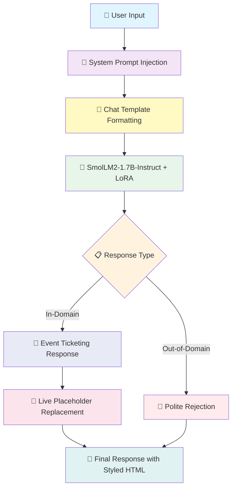

# 🎫 Event Ticketing Chatbot — Fine-tuning SmolLM2-1.7B-Instruct with LoRA

<div align="center">


<h3>🚀 A domain-specific event ticketing chatbot powered by SmolLM2-1.7B-Instruct, fine-tuned with LoRA (Low-Rank Adaptation) for parameter-efficient training with built-in OOD handling and live placeholder replacement</h3>

[SmolLM2 Base Model](https://huggingface.co/HuggingFaceTB/SmolLM2-1.7B-Instruct) • [Training Dataset](https://huggingface.co/datasets/bitext/Bitext-events-ticketing-llm-chatbot-training-dataset) • [Fine-Tuned Model](https://huggingface.co/IamPradeep/SmolLM2-1.7B-Instruct-Event-Ticketing-Chatbot)

</div>

---

## 📋 Table of Contents

- [Overview](#-overview)
- [Key Features](#-key-features)
- [System Architecture](#-system-architecture)
- [Model Details](#-model-details)
- [Dataset](#-dataset)
- [Training Pipeline](#-training-pipeline)
- [Training Results](#-training-results)
- [Inference & Usage](#-inference--usage)
- [Example Interactions](#-example-interactions)
- [Installation](#-installation)
- [Project Structure](#-project-structure)
- [License](#-license)
- [Acknowledgments](#-acknowledgments)

---

## 🌟 Overview

The **Event Ticketing Chatbot** is an AI-powered customer support assistant fine-tuned on **SmolLM2-1.7B-Instruct** using **LoRA (Low-Rank Adaptation)** — a parameter-efficient fine-tuning technique. The model is trained on event ticketing domain data combined with out-of-domain samples, enabling it to provide **detailed, context-aware responses** for ticket-related queries while **gracefully declining** off-topic requests.

### 🎯 What Makes This Special?

Unlike multi-model pipeline approaches, this system leverages the power of a **single fine-tuned 1.7B parameter instruction model** with a carefully crafted **system prompt** to handle both in-domain responses and out-of-domain rejection — all within one model. Combined with **LoRA** for efficient training and **live placeholder replacement** for dynamic responses, it delivers professional customer support at a fraction of the computational cost.

---

## ✨ Key Features

<table>
<tr>
<td width="50%">

### 🧠 Single-Model Architecture
- **SmolLM2-1.7B-Instruct** handles both in-domain and OOD queries
- System prompt-driven behavior control
- No separate classifier needed
- Graceful out-of-domain rejection built into the model

</td>
<td width="50%">

### ⚡ Parameter-Efficient Fine-Tuning
- **LoRA (Low-Rank Adaptation)** with rank 32
- Only **~0.98%** of parameters are trainable
- Trains in **~1 hour** on a single GPU
- Original model weights remain frozen

</td>
</tr>
<tr>
<td width="50%">

### 💬 Natural Response Generation
- **Streaming text generation** for real-time interaction
- Uses official **chat template** format
- Professional, context-aware replies
- Handles spelling errors in user queries

</td>
<td width="50%">

### 🔄 Live Placeholder Replacement
- **60+ static placeholders** dynamically replaced
- Converts `{{WEBSITE_URL}}` → clickable links
- Converts `{{CANCEL_TICKET_SECTION}}` → styled HTML
- Real-time replacement during streaming

</td>
</tr>
<tr>
<td width="50%">

### 📊 Comprehensive Data Pipeline
- **28,486 training samples** (in-domain + OOD)
- Data cleaning: duplicates, offensive words, placeholder normalization
- Balanced category and intent distributions
- Structured chat template formatting

</td>
<td width="50%">

### 🎨 Persona-Based System Prompt
- **"Eventra"** — a named AI assistant persona
- Clear instruction boundaries in system prompt
- Example-driven few-shot guidance
- Anti-hallucination directives

</td>
</tr>
</table>

---

## 🏗️ System Architecture



### Component Breakdown

| Component | Model/Technology | Purpose |
|-----------|-----------------|---------|
| **Base Model** | `HuggingFaceTB/SmolLM2-1.7B-Instruct` | Pre-trained instruction-tuned LLM |
| **Fine-Tuning** | LoRA (PEFT) | Parameter-efficient adaptation |
| **Training Framework** | SFTTrainer (TRL) | Supervised fine-tuning |
| **Chat Formatting** | SmolLM2 Chat Template | Structured prompt formatting |
| **Placeholder Engine** | Custom Python Replacer | Dynamic response styling |
| **Experiment Tracking** | Weights & Biases | Training metrics logging |

---

## 🤖 Model Details

### SmolLM2-1.7B-Instruct

<details>
<summary><b>Click to expand model overview</b></summary>

**SmolLM2** is a family of compact language models released by Hugging Face in three sizes — 135M, 360M, and 1.7B parameters. The **1.7B-Instruct** variant is instruction-tuned for following user instructions accurately.

**Key Characteristics:**
- **Architecture:** Transformer decoder (LLaMA-based), trained in **bfloat16** precision
- **Training Data:** Pre-trained on ~**11 trillion tokens** from diverse sources (FineWeb-Edu, DCLM, Stack-Edu, etc.)
- **Layers:** 24 LlamaDecoderLayers with 2048 hidden dimension
- **Vocabulary:** 49,152 tokens
- **License:** Apache 2.0

**Benchmarks (SmolLM2-1.7B-Instruct):**

<div align="center">

| Task | SmolLM2-1.7B-Instruct | vs Llama-1B-Instruct |
|------|----------------------|---------------------|
| IFEval (instr. following) | 56.7 | 53.5 |
| MT-Bench | 6.13 | 5.48 |
| HellaSwag | 66.1 | 56.1 |
| ARC (avg) | 51.7 | 41.6 |
| PIQA | 74.4 | 72.3 |
| MMLU-Pro | 19.3 | 12.7 |
| BBH (3-shot) | 32.2 | 27.6 |
| GSM8K (5-shot) | 48.2 | 26.8 |

</div>

</details>

### LoRA Configuration

<details>
<summary><b>Click to expand LoRA details</b></summary>

**LoRA (Low-Rank Adaptation)** is a parameter-efficient fine-tuning technique that freezes the original model weights and injects small trainable low-rank matrices into each layer.

**Configuration Used:**
```python
peft_config = LoraConfig(
    r=32,                        # LoRA rank (low-rank dimension)
    lora_alpha=64,               # Scaling factor for LoRA weights
    lora_dropout=0.01,           # Dropout for regularization
    bias="none",                 # Don't update bias terms
    task_type="CAUSAL_LM",       # For causal language modeling
    target_modules="all-linear"  # Applying LoRA to all linear layers
)
```

**How LoRA Works:**

Instead of updating the full weight matrix `W`, LoRA decomposes the update into two low-rank matrices:

$$\Delta W = A \cdot B$$

where:
- `A ∈ ℝ^(d × r)` — tall, skinny matrix
- `B ∈ ℝ^(r × k)` — short, wide matrix
- `r << min(d, k)` — the rank (set to 32)

The modified forward pass becomes:

$$W' = W + \alpha \cdot A \cdot B$$

**LoRA Applied To:**
- `q_proj`, `k_proj`, `v_proj`, `o_proj` (Self-Attention)
- `gate_proj`, `up_proj`, `down_proj` (MLP/FFN)

**Benefits:**
| Aspect | Full Fine-Tuning | LoRA Fine-Tuning |
|--------|-----------------|-----------------|
| Trainable Parameters | 100% (~1.7B) | ~0.98% |
| Training Time | Hours | ~1 Hour |
| GPU Memory | Very High | Moderate |
| Base Model | Modified | Frozen |
| Adapter Size | Full Model | Small Adapter |

</details>

---

## 📊 Dataset

### Data Sources

| Source | Samples | Type |
|--------|---------|------|
| [Bitext Events Ticketing Dataset](https://huggingface.co/datasets/bitext/Bitext-events-ticketing-llm-chatbot-training-dataset) | 24,700 | In-Domain |
| Out-of-Domain Queries | 3,786 | OOD |
| **Total** | **28,486** | **Combined** |

### Data Cleaning Pipeline

```
Raw Dataset (24,702 rows)
    │
    ├── Step 1: Remove Duplicates ──────────── 2 duplicates removed → 24,700 rows
    │
    ├── Step 2: Remove Offensive Words ─────── "f***ing" removed from instructions
    │
    ├── Step 3: Capitalize First Letter ────── Consistent formatting
    │
    ├── Step 4: Normalize Placeholders ─────── {{TICKET_EVENT}} → {{EVENT}}
    │
    ├── Step 5: Adjust Response Phrasing ───── "Should you" → "If you"
    │
    ├── Step 6: Add OOD Samples ────────────── +3,786 out-of-domain queries
    │
    └── Final Dataset: 28,486 rows (3 columns: instruction, intent, response)
```

### Dataset Statistics

<div align="center">

| Metric | Value |
|--------|-------|
| Total Samples | 28,486 |
| In-Domain Samples | 24,700 |
| Out-of-Domain Samples | 3,786 |
| Unique Intents | 28 (27 in-domain + 1 OOD) |
| Categories | 7 |
| Missing Values | 0 |
| Max Token Length | 512 |

</div>

### Chat Template Format

The dataset is formatted using SmolLM2's official chat template:

```
<|im_start|>user
How can I cancel my ticket for the concert in London?<|im_end|>
<|im_start|>assistant
To cancel your ticket for the concert in London, please follow these steps:

1. Access {{WEBSITE_URL}} and sign in to your account.
2. Proceed to the {{CANCEL_TICKET_SECTION}} section.
3. Locate your scheduled events and choose the concert in London.
4. Select the {{CANCEL_TICKET_OPTION}} option.
5. Complete the process by following the on-screen instructions.

If you face any difficulties, do not hesitate to reach out to our customer support team.<|im_end|>
```

---

## 🔧 Training Pipeline

### Training Configuration

```python
training_arguments = TrainingArguments(
    output_dir='./SmolLM2-support',
    per_device_train_batch_size=4,
    gradient_accumulation_steps=4,      # Effective batch size: 16
    optim="adamw_torch",
    learning_rate=2e-4,
    num_train_epochs=1,
    fp16=True,                          # Mixed precision training
    logging_steps=10,
    save_steps=500,
    lr_scheduler_type="linear"
)

trainer = SFTTrainer(
    model=model,
    args=training_arguments,
    train_dataset=tokenized_dataset,
    peft_config=peft_config
)
```

### Training Infrastructure

| Component | Details |
|-----------|---------|
| **GPU** | NVIDIA GPU (Google Colab) |
| **Precision** | FP16 (Mixed Precision) |
| **Optimizer** | AdamW (PyTorch) |
| **LR Scheduler** | Linear Warmup & Decay |
| **Learning Rate** | 2e-4 |
| **Effective Batch Size** | 16 (4 × 4 gradient accumulation) |
| **Epochs** | 1 |
| **Total Steps** | 1,781 |
| **Max Sequence Length** | 512 tokens |
| **Experiment Tracking** | Weights & Biases |

---

## 📈 Training Results

### Training Loss Over Steps

<div align="center">

| Step | Training Loss |
|------|--------------|
| 100 | 0.1813 |
| 200 | 0.1169 |
| 300 | 0.0962 |
| 400 | 0.0911 |
| 500 | 0.0879 |
| 600 | 0.0859 |
| 700 | 0.0824 |
| 800 | 0.0798 |
| 900 | 0.0793 |
| 1000 | 0.0791 |
| 1100 | 0.0758 |
| 1200 | 0.0748 |
| 1300 | 0.0714 |
| 1400 | 0.0712 |
| 1500 | 0.0680 |
| 1600 | 0.0676 |
| 1700 | 0.0664 |

</div>

### Training Summary

```
┌──────────────────────────────────────────────────────┐
│              Training Summary                        │
├──────────────────────────────────────────────────────┤
│  Total Steps:              1,781                     │
│  Average Training Loss:    0.0957                    │
│  Final Training Loss:      ~0.066                    │
│  Training Time:            ~1 hour                   │
│  Trainable Parameters:     ~0.98% of total           │
│  Epochs:                   1                          │
└──────────────────────────────────────────────────────┘
```

```
Training Loss Progression:
█████████████████████████████████████████████████████████████████████████
█ Step 100:   ██████████████████████████████████████  0.1813            █
█ Step 200:   ████████████████████████               0.1169            █
█ Step 300:   ████████████████████                   0.0962            █
█ Step 500:   ██████████████████                     0.0879            █
█ Step 700:   █████████████████                      0.0824            █
█ Step 1000:  ████████████████                       0.0791            █
█ Step 1300:  ██████████████                         0.0714            █
█ Step 1500:  █████████████                          0.0680            █
█ Step 1700:  █████████████                          0.0664            █
█████████████████████████████████████████████████████████████████████████
```

---

## 💻 Inference & Usage

### System Prompt

The model uses a carefully crafted system prompt to control behavior:

```python
system_prompt = """You are Eventra, an AI assistant created by Pradeep. 
You specialize ONLY in event ticket-related queries.

### Event Ticket Related Query:
**User**: "How do I cancel my ticket for the concert in us?"
**Response**: "To cancel your ticket for the concert in USA, please follow these steps: ..."

### Non-Ticket Related Query (Follow Exact Response):
**User**: "Explain theory of relativity in detail?"
**Response**: "I apologize, but I can only assist with event ticket-related queries. 
Is there anything about event tickets I can help you with?"

Note: No hallucinations please.
Now, please respond to the following user query ONLY if it is related to event tickets:
"""
```

### Generation Parameters

```python
model.generate(
    max_new_tokens=256,
    do_sample=True,
    temperature=0.5,
    top_p=0.95,
    pad_token_id=tokenizer.eos_token_id,
    streamer=streamer       # Live streaming output
)
```

### Placeholder Replacement

The model generates responses with template placeholders that are dynamically replaced during streaming:

```python
static_placeholders = {
    "{{WEBSITE_URL}}":              "[website](https://github.com/MarpakaPradeepSai)",
    "{{SUPPORT_TEAM_LINK}}":        "[support team](https://github.com/MarpakaPradeepSai)",
    "{{CANCEL_TICKET_SECTION}}":    "<b>Ticket Cancellation</b>",
    "{{CANCEL_TICKET_OPTION}}":     "<b>Cancel Ticket</b>",
    "{{UPGRADE_TICKET_OPTION}}":    "<b>Upgrade Ticket</b>",
    "{{TICKET_SECTION}}":           "<b>Ticketing</b>",
    "{{REFUND_SECTION}}":           "<b>Refund</b>",
    # ... 60+ more placeholders
}
```

### Programmatic Usage

```python
import torch
from transformers import AutoModelForCausalLM, AutoTokenizer, TextStreamer
from peft import PeftModel

# Load fine-tuned model
model_path = "path/to/fine-tuned-model"
tokenizer = AutoTokenizer.from_pretrained(model_path, use_fast=True)

if tokenizer.pad_token is None:
    tokenizer.pad_token = tokenizer.eos_token

model = AutoModelForCausalLM.from_pretrained(
    model_path,
    torch_dtype=torch.float16,
    device_map="auto"
)
model.eval()

# Initialize streamer
streamer = TextStreamer(tokenizer, skip_prompt=True, skip_special_tokens=True)

def stream_response(instruction, max_new_tokens=256):
    messages = [
        {"role": "system", "content": system_prompt},
        {"role": "user", "content": instruction},
    ]

    # Build prompt using official chat template
    prompt = tokenizer.apply_chat_template(
        messages,
        tokenize=False,
        add_generation_prompt=True
    )

    inputs = tokenizer(prompt, return_tensors="pt").to(model.device)

    with torch.no_grad():
        _ = model.generate(
            **inputs,
            max_new_tokens=max_new_tokens,
            do_sample=True,
            temperature=0.5,
            top_p=0.95,
            pad_token_id=tokenizer.eos_token_id,
            streamer=streamer
        )

# Example usage
stream_response("How can I cancel my ticket for the upcoming concert in India?")
```

---

## 💬 Example Interactions

<table>
<tr>
<th>Query Type</th>
<th>User Query</th>
<th>Bot Response</th>
</tr>
<tr>
<td>✅ In-Domain</td>
<td>

```
How can I cancel my ticket for 
the upcoming cricket event in india?
```

</td>
<td>

```
To cancel your ticket for the upcoming 
cricket event in India, please adhere 
to the following steps:

1. Access [website] and sign in to your account.
2. Proceed to the Ticket Cancellation section.
3. Locate your scheduled events and choose 
   the cricket event in India.
4. Select the Cancel Ticket option.
5. Complete the process by following the 
   on-screen instructions for cancellation.

If you face any difficulties, do not hesitate 
to reach out to our customer support team 
for further help.
```

</td>
</tr>
<tr>
<td>✅ In-Domain</td>
<td>

```
How can I upgrade my ticket for 
the upcoming concert in us?
```

</td>
<td>

```
To upgrade your ticket for the upcoming 
concert in the United States, please 
follow these steps:

1. Go to the [website].
2. Sign in to your account using your 
   login details.
3. Head to the Ticketing section.
4. Find your current ticket under 
   Upgrade Ticket Information and choose 
   the Upgrade Ticket option.
5. Complete the process by following the 
   on-screen prompts to select your desired 
   upgrade and confirm the payment.

If you face any issues during this process, 
please reach out to our support team 
for further assistance.
```

</td>
</tr>
<tr>
<td>🚫 Out-of-Domain</td>
<td>

```
Explain the working of 
Large Language Model?
```

</td>
<td>

```
I'm sorry, but I can't offer assistance 
on this topic. If you have questions 
about event tickets, feel free to ask!
```

</td>
</tr>
<tr>
<td>🚫 Out-of-Domain</td>
<td>

```
Explain Transformer architecture 
in detail?
```

</td>
<td>

```
I apologize, but I can only assist with 
event ticket-related inquiries. Is there 
anything about event tickets I can help 
you with?
```

</td>
</tr>
</table>

---

## 🚀 Installation

### Prerequisites

- Python 3.8+
- CUDA-compatible GPU (recommended)
- 8GB+ GPU Memory

### Quick Start

```bash
# Clone the repository
git clone https://github.com/MarpakaPradeepSai/Advanced-Event-Ticketing-Customer-Support-Chatbot.git
cd Advanced-Event-Ticketing-Customer-Support-Chatbot

# Create virtual environment
python -m venv venv
source venv/bin/activate  # On Windows: venv\Scripts\activate

# Install dependencies
pip install -r requirements.txt
```

### Requirements

```txt
torch>=2.0.0
transformers>=4.56.0
peft
trl>=0.29.0
datasets>=4.0.0
accelerate
wandb
pandas
matplotlib
seaborn
sentencepiece
```

### Model Downloads

| Model | Source | Size |
|-------|--------|------|
| SmolLM2-1.7B-Instruct (Base) | `HuggingFaceTB/SmolLM2-1.7B-Instruct` | ~3.42 GB |
| Fine-Tuned LoRA Adapter | Fine-tuned checkpoint | ~67 MB |

---

## 📁 Project Structure

```
Advanced-Event-Ticketing-Customer-Support-Chatbot/
│
├── Data/                                   # Dataset Repository
│   ├── Bitext-events-ticketing-llm-chatbot-training-dataset.csv
│   └── extra-large-out-of-domain.csv       # OOD samples
│
├── Notebook/                               # Model Training
│   └── Fine_tuning_SmolLM2_1_7B_Instruct_with_LoRA.ipynb
│
├── requirements.txt                        # Project Dependencies
├── LICENSE                                 # MIT License
└── README.md                               # Documentation
```

---

## 📄 License

This project is licensed under the MIT License - see the [LICENSE](LICENSE) file for details.

---

## 🙏 Acknowledgments

<div align="center">

| Resource | Description |
|----------|-------------|
| [Hugging Face](https://huggingface.co/) | Transformers, PEFT, TRL libraries & model hosting |
| [SmolLM2](https://huggingface.co/HuggingFaceTB/SmolLM2-1.7B-Instruct) | Base pre-trained model |
| [Bitext](https://huggingface.co/datasets/bitext/Bitext-events-ticketing-llm-chatbot-training-dataset) | Event ticketing training dataset |
| [Weights & Biases](https://wandb.ai/) | Experiment tracking |
| [LoRA Paper](https://arxiv.org/abs/2106.09685) | Low-Rank Adaptation methodology |

</div>

---

<div align="center">

### ⭐ Star this repository if you found it helpful!

<br>

**Built with ❤️ by [Marpaka Pradeep Sai](https://github.com/MarpakaPradeepSai)**

</div>
