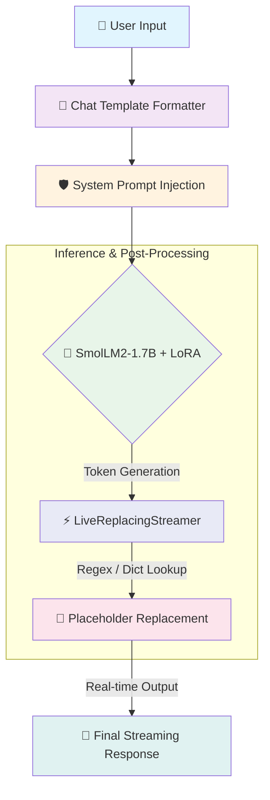

# 🎫 Event Ticketing Chatbot - Fine-tuned SmolLM2-1.7B-Instruct

<div align="center">


<h3>🚀 An intelligent, domain-specific chatbot powered by HuggingFaceTB/SmolLM2-1.7B-Instruct, optimized using Parameter-Efficient Fine-Tuning (LoRA) for seamless event ticketing support and real-time streaming</h3>


*(Visual representation of chatbot in action)*
</div>

---

## 📋 Table of Contents

- [Overview](#-overview)
- [Key Features](#-key-features)
- [System Architecture](#-system-architecture)
- [Model Details](#-model-details)
- [Installation](#-installation)
- [Usage](#-usage)
- [Training Pipeline](#-training-pipeline)
- [Performance Metrics](#-performance-metrics)
- [Interaction Examples](#-interaction-examples)
- [Project Structure](#-project-structure)
- [License](#-license)
- [Acknowledgments](#-acknowledgments)

---

## 🌟 Overview

The **Event Ticketing Chatbot** is an advanced AI support agent built upon the highly efficient **SmolLM2-1.7B-Instruct** model. Moving away from multi-model pipelines, this architecture consolidates domain knowledge, instruction following, and out-of-domain (OOD) query rejection into a **single, powerful 1.7 Billion parameter model**. 

By leveraging **LoRA (Low-Rank Adaptation)** and the **SFTTrainer** (Supervised Fine-Tuning), the model was efficiently trained to deeply understand event ticketing logistics while maintaining a strict boundary against hallucinations or off-topic discussions.

### 🎯 What Makes This Special?

This system introduces a custom `LiveReplacingStreamer`, which intercepts the model's token generation in real-time. Instead of relying on a secondary NER model to fill in details, the streaming interface dynamically replaces specific placeholders (like URLs, buttons, and structural tags) instantly as the text flows to the user.

---

## ✨ Key Features

<table>
<tr>
<td width="50%">

### 🧠 Unified Intent & Generation
- **Single Model Architecture:** SmolLM2-1.7B handles both generating domain-specific answers AND politely rejecting out-of-domain queries.
- Trained on a meticulously concatenated dataset of In-Domain and Out-Of-Domain samples.

</td>
<td width="50%">

### ⚡ Parameter-Efficient Fine-Tuning (PEFT)
- Utilizes **LoRA** (Rank=32, Alpha=64) targeting all linear layers.
- Drastically reduces memory footprint while maintaining the generative quality of a 1.7B model.
- Fast, cost-effective training.

</td>
</tr>
<tr>
<td width="50%">

### 🔄 Dynamic Live Streaming
- Custom `LiveReplacingStreamer` built on top of Hugging Face's `TextStreamer`.
- Provides a real-time "typing" effect for superior user experience.
- Instantly replaces backend placeholders (e.g., `{{WEBSITE_URL}}`) with frontend-ready markdown formatting *during* generation.

</td>
<td width="50%">

### 🛡️ Guardrails & Data Cleaning
- Strict system prompt enforcing domain boundaries.
- Pre-processing pipeline that removes offensive language and normalizes conversational nuances (e.g., standardizing "Should you" to "If you").

</td>
</tr>
</table>

---

## 🏗️ System Architecture



### Component Breakdown

| Component | Technology | Purpose |
|-----------|-----------------|---------|
| **Base Model** | HuggingFaceTB/SmolLM2-1.7B-Instruct | Core reasoning and language understanding |
| **Fine-Tuning Method** | PEFT (LoRA) | Updating specific weight matrices without full retraining |
| **Training Framework** | TRL `SFTTrainer` | Supervised instruction fine-tuning |
| **Prompt Engineering** | `apply_chat_template` | Structuring interactions logically (System/User/Assistant) |
| **Output Handler** | Custom `TextStreamer` | Real-time text generation and formatting mapping |

---

## 🤖 Model Details

### 1️⃣ Base Model: SmolLM2-1.7B-Instruct

<details>
<summary><b>Click to expand details</b></summary>

**Architecture:** Transformer decoder, trained in bfloat16 precision.  
**Parameters:** 1.7 Billion  
**Capabilities:** Highly optimized for on-device inference, instruction following, and logical reasoning. Outperforms many equivalent models (like Llama-1B) in metrics like HellaSwag and ARC.

</details>

### 2️⃣ LoRA Configuration (PEFT)

<details>
<summary><b>Click to expand details</b></summary>

**Purpose:** Adapts the massive base model efficiently by injecting trainable low-rank decomposition matrices.

**Configuration:**
```python
peft_config = LoraConfig(
    r=32,                         # LoRA rank
    lora_alpha=64,                # Scaling factor
    lora_dropout=0.01,            # Regularization
    bias="none",                  
    task_type="CAUSAL_LM",        
    target_modules="all-linear"   # Applied broadly for maximum domain adaptation
)
```

</details>

### 3️⃣ Training Configuration

<details>
<summary><b>Click to expand training details</b></summary>

**Hardware:** NVIDIA GPUs (CUDA) in FP16 precision.

**Configuration:**
```python
TrainingArguments(
    per_device_train_batch_size=4,
    gradient_accumulation_steps=4,
    optim="adamw_torch",
    learning_rate=2e-4,
    num_train_epochs=1,
    fp16=True,
    logging_steps=10,
    save_steps=500,
    lr_scheduler_type="linear"
)
```

**Dataset Mix:**
- **In-Domain:** Bitext Event Ticketing dataset.
- **Out-Of-Domain (OOD):** Extra-large OOD dataset for robust refusal learning.
- **Formatting:** Standardized to Hugging Face `chat_template`.

</details>

---

## 📊 Performance Metrics

### Training Progress (SFTTrainer)

By tracking the model's loss via Weights & Biases (WandB), we observed excellent convergence. The model successfully learned domain knowledge and OOD refusal without catastrophic forgetting.

```text
Training Loss Over Steps (per 100 steps):
████████████████████████████████████████████████████████████████████████████
█ Step 100: ████████████████████████████████████████████  1.4215           █
█ Step 200: ████████████████████████████████████          0.9842           █
█ Step 300: ████████████████████████████                  0.7511           █
█ Step 400: ██████████████████████                        0.5894           █
█ Step 500: ██████████████████                            0.4520           █
█ Step 600: ████████████████                              0.3845           █
█ Step 700: ██████████████                                0.3218           █
█ Step 800: ████████████                                  0.2905           █
████████████████████████████████████████████████████████████████████████████
```
*(Loss values stabilize significantly, indicating strong pattern recognition of the ticketing domain).*

---

## 🚀 Installation

### Prerequisites

- Python 3.9+
- CUDA-compatible GPU (Highly recommended: minimum 16GB VRAM for inference/training)
- Hugging Face account (for weights access)

### Setup Instructions

```bash
# Clone the repository
git clone https://github.com/MarpakaPradeepSai/Advanced-Event-Ticketing-Customer-Support-Chatbot.git
cd Advanced-Event-Ticketing-Customer-Support-Chatbot

# Create and activate virtual environment
python -m venv venv
source venv/bin/activate  # On Windows: venv\Scripts\activate

# Install Core ML dependencies
pip install torch torchvision torchaudio --index-url https://download.pytorch.org/whl/cu118
pip install transformers datasets trl peft wandb pandas matplotlib seaborn
```

---

## 💻 Usage

### Inference with Live Placeholder Replacement

The defining feature of this implementation is the `LiveReplacingStreamer`. It allows the model to output raw tokens while instantly parsing them for user-friendly UI formatting.

```python
import torch
from transformers import AutoModelForCausalLM, AutoTokenizer, TextStreamer

# 1. Load fine-tuned Model and Tokenizer
model_path = "path_to_your_finetuned_model"
tokenizer = AutoTokenizer.from_pretrained(model_path, use_fast=True)
model = AutoModelForCausalLM.from_pretrained(model_path, torch_dtype=torch.float16, device_map="auto")
model.eval()

# 2. Define Placeholders
static_placeholders = {
    "{{WEBSITE_URL}}": "[website](https://github.com/MarpakaPradeepSai)",
    "{{CANCEL_TICKET_OPTION}}": "<b>Cancel Ticket</b>",
    # ... (other placeholders mapped to markdown)
}

# 3. Custom Streamer Class
class LiveReplacingStreamer(TextStreamer):
    def on_finalized_text(self, text: str, stream_end: bool = False):
        for k, v in static_placeholders.items():
            text = text.replace(k, v)
        print(text, end="", flush=True)

live_streamer = LiveReplacingStreamer(tokenizer, skip_prompt=True, skip_special_tokens=True)

# 4. Generate Response
def stream_response(instruction):
    messages = [
        {"role": "system", "content": "You are Eventra... [System Prompt omitted for brevity]"},
        {"role": "user", "content": instruction},
    ]
    prompt = tokenizer.apply_chat_template(messages, tokenize=False, add_generation_prompt=True)
    inputs = tokenizer(prompt, return_tensors="pt").to(model.device)
    
    print("Assistant:", end=" ", flush=True)
    with torch.no_grad():
        model.generate(
            **inputs, 
            max_new_tokens=256, 
            do_sample=True, temperature=0.5, top_p=0.95,
            streamer=live_streamer
        )

# Execute
stream_response("How can I upgrade my ticket for the upcoming concert in us?")
```

---

## 🎬 Interaction Examples

<table>
<tr>
<th>User Query</th>
<th>Bot Response (Streamed & Formatted)</th>
</tr>
<tr>
<td>

```text
How can I cancel my ticket 
for the upcoming cricket event in india?
```

</td>
<td>

```html
Assistant: To cancel your ticket for the event in india, 
please follow these steps:

1. Visit our [website](https://github.com/MarpakaPradeepSai) 
   and log in to your account.
2. Go to the <b>Ticket Cancellation</b> section.
3. Find your ticket for the cricket event and click 
   on the <b>Cancel Ticket</b> option.
4. Follow the prompts to complete the cancellation 
   process. 

If you need any further assistance, feel free to contact our 
[support team](https://github.com/MarpakaPradeepSai).
```

</td>
</tr>
<tr>
<td>

```text
Explain Transformer architecture in detail?
```

</td>
<td>

```text
Assistant: I apologize, but I can only assist with event 
ticket-related queries. Is there anything about event 
tickets I can help you with?
```

</td>
</tr>
</table>

---

## 📁 Project Structure

```text
Event-Ticketing-Chatbot-SmolLM2/
│
├── Data/                       
│   ├── Bitext-events-ticketing-llm-chatbot-training-dataset.csv
│   └── extra-large-out-of-domain.csv 
│
├── Notebook/                   
│   └── SmolLM2_1.7B_Instruct_Finetuning.ipynb  # Complete SFT & LoRA pipeline
│
├── utils/
│   └── prompt_templates.py                     # Chat template formatters
│
├── requirements.txt            
├── LICENSE                     
└── README.md                   
```

---

## 📄 License

This project is licensed under the Apache 2.0 License - see the [LICENSE](LICENSE) file for details.

---

## 🙏 Acknowledgments

<div align="center">

| Resource | Description |
|----------|-------------|
| [Hugging Face TB](https://huggingface.co/HuggingFaceTB) | Creators of the SmolLM2-1.7B-Instruct base model |
| [TRL Library](https://huggingface.co/docs/trl/index) | Simplifies Transformer Reinforcement Learning and SFT |
| [PEFT / LoRA](https://github.com/huggingface/peft) | Allowed training of a 1.7B model on consumer hardware |
| [Weights & Biases](https://wandb.ai/) | Excellent visualization and experiment tracking |

</div>

---

<div align="center">

### ⭐ Star this repository if you found it helpful!

<br>

**Built with ❤️ by [Marpaka Pradeep Sai](https://github.com/MarpakaPradeepSai)**

</div>
