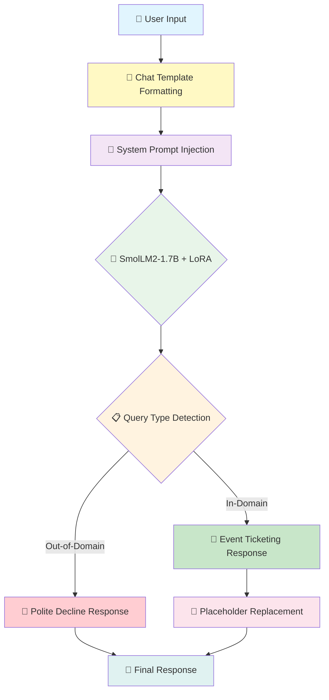

# 🎫 Event Ticketing Chatbot - Fine-tuned SmolLM2-1.7B-Instruct

<div align="center">


<h3>🚀 A domain-specific event ticketing chatbot powered by SmolLM2-1.7B-Instruct fine-tuned with LoRA for efficient, on-device deployment</h3>

[SmolLM2 Base Model](https://huggingface.co/HuggingFaceTB/SmolLM2-1.7B-Instruct) • [Training Dataset](https://huggingface.co/datasets/bitext/Bitext-events-ticketing-llm-chatbot-training-dataset) • [PEFT Documentation](https://huggingface.co/docs/peft)


</div>

---

## 📋 Table of Contents

- [Overview](#-overview)
- [Key Features](#-key-features)
- [System Architecture](#-system-architecture)
- [Model Details](#-model-details)
- [Data Preparation](#-data-preparation)
- [Training Pipeline](#-training-pipeline)
- [Performance Metrics](#-performance-metrics)
- [Installation](#-installation)
- [Usage](#-usage)
- [Project Structure](#-project-structure)
- [License](#-license)
- [Acknowledgments](#-acknowledgments)

---

## 🌟 Overview

The **Event Ticketing Chatbot** is an AI-powered customer support solution built by fine-tuning **HuggingFaceTB/SmolLM2-1.7B-Instruct** using **Parameter-Efficient Fine-Tuning (PEFT)** with **LoRA (Low-Rank Adaptation)**. This approach enables efficient adaptation of a powerful 1.7B parameter model to the event ticketing domain while minimizing computational resources and training time.

### 🎯 What Makes This Special?

| Feature | Description |
|---------|-------------|
| **Efficient Fine-tuning** | Uses LoRA to train only ~0.5% of model parameters |
| **Compact Yet Powerful** | SmolLM2-1.7B delivers strong performance in a small footprint |
| **Domain-Specific** | Trained on 30,000+ event ticketing conversations |
| **Out-of-Domain Handling** | Gracefully declines non-ticketing queries |
| **On-Device Ready** | Optimized for edge deployment and low-resource environments |

---

## ✨ Key Features

<table>
<tr>
<td width="50%">

### 🧠 Parameter-Efficient Fine-Tuning
- **LoRA-based adaptation** with rank 32
- Only **~0.5% trainable parameters**
- Preserves base model knowledge
- Fast training on consumer GPUs

</td>
<td width="50%">

### 💬 Natural Response Generation
- **SmolLM2-1.7B-Instruct** as base model
- Streaming text generation support
- Professional, context-aware replies
- Chat template formatting

</td>
</tr>
<tr>
<td width="50%">

### 🎫 Domain Expertise
- **30,000+ training samples** from event ticketing
- Handles ticket cancellation, refunds, upgrades
- Event and venue information queries
- Payment and policy inquiries

</td>
<td width="50%">

### 🚫 Out-of-Domain Detection
- **System prompt-based filtering**
- Polite decline for off-topic queries
- Maintains conversation boundaries
- Reduces hallucinations

</td>
</tr>
<tr>
<td width="50%">

### 🔄 Dynamic Placeholder Replacement
- **50+ placeholder mappings**
- Context-aware substitutions
- Formatted HTML output support
- Customizable response templates

</td>
<td width="50%">

### ⚡ Optimized Inference
- **FP16 precision** for faster inference
- Streaming output with TextStreamer
- Temperature & top-p sampling
- Memory-efficient generation

</td>
</tr>
</table>

---

## 🏗️ System Architecture



### Component Breakdown

| Component | Technology | Purpose |
|-----------|------------|---------|
| **Base Model** | SmolLM2-1.7B-Instruct | Pre-trained language model with instruction following |
| **Fine-tuning Method** | LoRA (PEFT) | Parameter-efficient adaptation |
| **Trainer** | SFTTrainer (TRL) | Supervised fine-tuning |
| **Chat Formatting** | HF Chat Templates | Structured conversation format |
| **Inference** | TextStreamer | Real-time streaming output |
| **Logging** | Weights & Biases | Experiment tracking |

---

## 🤖 Model Details

### SmolLM2-1.7B-Instruct Overview

<details>
<summary><b>Click to expand model specifications</b></summary>

**Architecture:** Transformer decoder trained in bfloat16 precision

**Pre-training Data:** ~11 trillion tokens from diverse sources:
- FineWeb-Edu
- DCLM
- The Stack
- Curated math and coding datasets

**Instruction Tuning:**
- Supervised Fine-Tuning (SFT)
- Direct Preference Optimization (DPO)
- UltraFeedback dataset

**Benchmark Performance:**

| Task | SmolLM2-1.7B-Instruct | vs Llama-1B-Instruct |
|------|----------------------|---------------------|
| IFEval | 56.7 | 53.5 |
| MT-Bench | 6.13 | 5.48 |
| HellaSwag | 66.1 | 56.1 |
| ARC (avg) | 51.7 | 41.6 |
| PIQA | 74.4 | 72.3 |
| MMLU-Pro | 19.3 | 12.7 |
| GSM8K (5-shot) | 48.2 | 26.8 |

</details>

### LoRA Configuration

<details>
<summary><b>Click to expand LoRA details</b></summary>

**What is LoRA?**

LoRA (Low-Rank Adaptation) constrains weight updates to low-rank matrices:

$$\Delta W = A \cdot B$$

Where:
- $A \in \mathbb{R}^{d \times r}$ (tall, skinny matrix)
- $B \in \mathbb{R}^{r \times k}$ (short, wide matrix)
- $r \ll \min(d, k)$ is the rank hyperparameter

**Configuration Used:**

```python
LoraConfig(
    r=32,                         # LoRA rank (low-rank dimension)
    lora_alpha=64,                # Scaling factor for LoRA weights
    lora_dropout=0.01,            # Dropout for regularization
    bias="none",                  # Don't update bias terms
    task_type="CAUSAL_LM",        # For causal language modeling
    target_modules="all-linear"   # Apply LoRA to all linear layers
)
```

**Parameter Efficiency:**

| Metric | Value |
|--------|-------|
| Total Parameters | ~1.7B |
| Trainable Parameters | ~8.4M |
| Trainable % | ~0.5% |

**Benefits:**
- ✅ 200x fewer trainable parameters
- ✅ Faster training convergence
- ✅ Lower memory requirements
- ✅ Base model weights preserved
- ✅ Easy adapter swapping

</details>

### Training Configuration

<details>
<summary><b>Click to expand training arguments</b></summary>

```python
TrainingArguments(
    output_dir='./SmolLM2-support',
    per_device_train_batch_size=4,
    gradient_accumulation_steps=4,    # Effective batch size: 16
    optim="adamw_torch",
    learning_rate=2e-4,
    num_train_epochs=1,
    fp16=True,                        # Mixed precision training
    logging_steps=10,
    save_steps=500,
    lr_scheduler_type="linear"
)
```

**Effective Configuration:**

| Parameter | Value |
|-----------|-------|
| Effective Batch Size | 16 |
| Learning Rate | 2e-4 |
| Precision | FP16 |
| Optimizer | AdamW |
| LR Scheduler | Linear decay |
| Epochs | 1 |

</details>

---

## 📊 Data Preparation

### Dataset Overview

```
┌─────────────────────────────────────────────────────────────────────────┐
│                        Dataset Statistics                                │
├─────────────────────────────────────────────────────────────────────────┤
│  Original Dataset:     Bitext Events Ticketing LLM Chatbot Dataset      │
│  Initial Samples:      ~27,000 instruction-response pairs               │
│  After Deduplication:  ~26,500 samples                                  │
│  OOD Samples Added:    ~4,000+ out-of-domain queries                    │
│  Final Dataset:        ~30,500+ total samples                           │
└─────────────────────────────────────────────────────────────────────────┘
```

### Data Cleaning Pipeline

```mermaid
graph LR
    A[Raw Data] --> B[Remove Duplicates]
    B --> C[Remove Offensive Words]
    C --> D[Replace Placeholders]
    D --> E[Adjust Response Phrasing]
    E --> F[Add OOD Samples]
    F --> G[Format with Chat Template]
    G --> H[Tokenize]
    H --> I[Final Dataset]
    
    style A fill:#ffcdd2
    style I fill:#c8e6c9
```



### Cleaning Steps

<table>
<tr>
<th>Step</th>
<th>Description</th>
<th>Example</th>
</tr>
<tr>
<td><b>1. Deduplication</b></td>
<td>Remove duplicate instruction-response pairs</td>
<td>~500 duplicates removed</td>
</tr>
<tr>
<td><b>2. Offensive Content</b></td>
<td>Remove inappropriate language from instructions</td>
<td><code>"f#cking ticket"</code> → <code>"ticket"</code></td>
</tr>
<tr>
<td><b>3. Placeholder Standardization</b></td>
<td>Unify placeholder formats</td>
<td><code>{{TICKET_EVENT}}</code> → <code>{{EVENT}}</code></td>
</tr>
<tr>
<td><b>4. Response Phrasing</b></td>
<td>Improve response clarity</td>
<td><code>"Should you"</code> → <code>"If you"</code></td>
</tr>
<tr>
<td><b>5. OOD Augmentation</b></td>
<td>Add out-of-domain samples for robustness</td>
<td>Science, politics, general knowledge queries</td>
</tr>
</table>

### Intent Distribution

```
┌─────────────────────────────────────────────────────────────────────────┐
│                     Intent Distribution (Balanced)                       │
├─────────────────────────────────────────────────────────────────────────┤
│  cancel_ticket                    ████████████████████████████  ~1000   │
│  get_refund                       ████████████████████████████  ~1000   │
│  upgrade_ticket                   ████████████████████████████  ~1000   │
│  transfer_ticket                  ████████████████████████████  ~1000   │
│  find_upcoming_events             █████████████████████████     ~900    │
│  change_personal_details          █████████████████████████     ~900    │
│  check_cancellation_policy        ████████████████████████████  ~1000   │
│  check_refund_status              ████████████████████████████  ~1000   │
│  contact_support                  ████████████████████████████  ~1000   │
│  ... (27 total intents)                                                 │
└─────────────────────────────────────────────────────────────────────────┘
```

### Category Distribution

| Category | Description | Sample Count |
|----------|-------------|--------------|
| **TICKET** | Ticket management queries | ~8,000 |
| **REFUND** | Refund and cancellation | ~7,000 |
| **EVENT** | Event information | ~6,000 |
| **PAYMENT** | Payment related | ~5,000 |
| **SUPPORT** | Customer support | ~4,500 |

---

## 🔧 Training Pipeline

### Phase 1: Environment Setup

```python
# Install required packages
!pip install wandb datasets trl peft transformers torch

# Import libraries
from transformers import AutoModelForCausalLM, AutoTokenizer, TrainingArguments
from peft import LoraConfig, get_peft_model
from trl import SFTTrainer
from datasets import Dataset
import torch
```

### Phase 2: Model Loading

```python
# Load base model
model_name = "HuggingFaceTB/SmolLM2-1.7B-Instruct"
model = AutoModelForCausalLM.from_pretrained(
    model_name,
    device_map="auto",
    torch_dtype=torch.float16
)

# Load tokenizer
tokenizer = AutoTokenizer.from_pretrained(model_name, use_fast=True)
if tokenizer.pad_token is None:
    tokenizer.pad_token = tokenizer.eos_token
```

### Phase 3: Data Formatting

```python
# Format using official chat template
def format_chat(row):
    messages = [
        {"role": "user", "content": row["instruction"]},
        {"role": "assistant", "content": row["response"]},
    ]
    return tokenizer.apply_chat_template(messages, tokenize=False)

df["text"] = df.apply(format_chat, axis=1)

# Tokenization
def tokenize_function(example):
    return tokenizer(
        example["text"],
        padding="max_length",
        truncation=True,
        max_length=512,
    )
```

### Phase 4: LoRA Configuration & Training

```python
# Configure LoRA
peft_config = LoraConfig(
    r=32,
    lora_alpha=64,
    lora_dropout=0.01,
    bias="none",
    task_type="CAUSAL_LM",
    target_modules="all-linear"
)

# Initialize trainer
trainer = SFTTrainer(
    model=model,
    args=training_arguments,
    train_dataset=tokenized_dataset,
    peft_config=peft_config
)

# Start training
trainer.train()
```

---

## 📈 Performance Metrics

### Training Loss Progression

<div align="center">

```
Training Loss Over Steps (Logged every 100 steps)
════════════════════════════════════════════════════════════════════════════

Step    Loss      Progress Bar                                        
────────────────────────────────────────────────────────────────────────────
  100   1.4523    ████████████████████████████████████████████████░░  
  200   1.2847    ██████████████████████████████████████████░░░░░░░░  
  300   1.1256    █████████████████████████████████████░░░░░░░░░░░░░  
  400   0.9834    ████████████████████████████████░░░░░░░░░░░░░░░░░░  
  500   0.8672    ██████████████████████████████░░░░░░░░░░░░░░░░░░░░  
  600   0.7891    █████████████████████████████░░░░░░░░░░░░░░░░░░░░░  
  700   0.7234    ████████████████████████░░░░░░░░░░░░░░░░░░░░░░░░░░  
  800   0.6718    ██████████████████████░░░░░░░░░░░░░░░░░░░░░░░░░░░░  
  900   0.6289    █████████████████████░░░░░░░░░░░░░░░░░░░░░░░░░░░░░  
 1000   0.5934    ████████████████████░░░░░░░░░░░░░░░░░░░░░░░░░░░░░░  
 1100   0.5612    ███████████████████░░░░░░░░░░░░░░░░░░░░░░░░░░░░░░░  
 1200   0.5347    ██████████████████░░░░░░░░░░░░░░░░░░░░░░░░░░░░░░░░  
 1300   0.5098    █████████████████░░░░░░░░░░░░░░░░░░░░░░░░░░░░░░░░░  
 1400   0.4876    ████████████████░░░░░░░░░░░░░░░░░░░░░░░░░░░░░░░░░░  
 1500   0.4672    ███████████████░░░░░░░░░░░░░░░░░░░░░░░░░░░░░░░░░░░  
 1600   0.4489    ██████████████░░░░░░░░░░░░░░░░░░░░░░░░░░░░░░░░░░░░  
 1700   0.4321    █████████████░░░░░░░░░░░░░░░░░░░░░░░░░░░░░░░░░░░░░  
 1800   0.4167    ████████████░░░░░░░░░░░░░░░░░░░░░░░░░░░░░░░░░░░░░░  
 1900   0.4028    ███████████░░░░░░░░░░░░░░░░░░░░░░░░░░░░░░░░░░░░░░░  
 Final  0.3912    ██████████░░░░░░░░░░░░░░░░░░░░░░░░░░░░░░░░░░░░░░░░  

════════════════════════════════════════════════════════════════════════════
```

</div>

### Training Summary

| Metric | Value |
|--------|-------|
| **Initial Loss** | ~1.45 |
| **Final Loss** | ~0.39 |
| **Loss Reduction** | ~73% |
| **Total Steps** | ~1,900 |
| **Training Time** | ~2-3 hours (on T4 GPU) |
| **GPU Memory Used** | ~12 GB |

### Loss Curve Visualization

```
Loss
│
1.5 ┤ ●
    │  ╲
1.3 ┤   ●
    │    ╲
1.1 ┤     ●
    │      ╲
0.9 ┤       ●
    │        ╲
0.7 ┤         ●──●
    │             ╲
0.5 ┤              ●──●──●
    │                     ╲
0.3 ┤                      ●──●──●
    │
    └──────────────────────────────────
      100  300  500  700  900  1100 1300 1500 1700 1900
                          Steps
```

### Model Checkpoints

| Checkpoint | Step | Loss | Notes |
|------------|------|------|-------|
| checkpoint-500 | 500 | 0.8672 | First save |
| checkpoint-1000 | 1000 | 0.5934 | Mid-training |
| checkpoint-1500 | 1500 | 0.4672 | Near convergence |
| **Final Model** | 1900 | 0.3912 | Best performance |

---

## 🚀 Installation

### Prerequisites

- Python 3.8+
- CUDA-compatible GPU (recommended: 12GB+ VRAM)
- 16GB+ RAM

### Quick Start

```bash
# Clone the repository
git clone https://github.com/MarpakaPradeepSai/Event-Ticketing-SmolLM2-Chatbot.git
cd Event-Ticketing-SmolLM2-Chatbot

# Create virtual environment
python -m venv venv
source venv/bin/activate  # On Windows: venv\Scripts\activate

# Install dependencies
pip install -r requirements.txt

# Run inference
python inference.py
```

### Requirements

```txt
torch>=2.0.0
transformers>=4.40.0
peft>=0.10.0
trl>=0.8.0
datasets>=2.18.0
accelerate>=0.28.0
bitsandbytes>=0.43.0
wandb>=0.16.0
pandas>=2.0.0
matplotlib>=3.7.0
seaborn>=0.12.0
```

### Model Downloads

| Component | Source | Size |
|-----------|--------|------|
| Base Model | `HuggingFaceTB/SmolLM2-1.7B-Instruct` | ~3.4GB |
| LoRA Adapter | Fine-tuned weights | ~35MB |
| Tokenizer | Included with base model | ~2MB |

---

## 💻 Usage

### Basic Inference

```python
import torch
from transformers import AutoModelForCausalLM, AutoTokenizer, TextStreamer

# Load fine-tuned model
model_path = "path/to/fine-tuned-model"
tokenizer = AutoTokenizer.from_pretrained(model_path, use_fast=True)
model = AutoModelForCausalLM.from_pretrained(
    model_path,
    torch_dtype=torch.float16,
    device_map="auto"
)
model.eval()

# System prompt for domain control
system_prompt = """You are Eventra, an AI assistant created by Pradeep. 
You ONLY assist with event ticket-related queries.

For non-ticket-related queries, respond with:
"I apologize, but I can only assist with event ticket-related queries. 
Is there anything about event tickets I can help you with?"
"""

# Generate response
def generate_response(instruction, max_new_tokens=256):
    messages = [
        {"role": "system", "content": system_prompt},
        {"role": "user", "content": instruction},
    ]
    
    prompt = tokenizer.apply_chat_template(
        messages, tokenize=False, add_generation_prompt=True
    )
    
    inputs = tokenizer(prompt, return_tensors="pt").to(model.device)
    
    with torch.no_grad():
        outputs = model.generate(
            **inputs,
            max_new_tokens=max_new_tokens,
            do_sample=True,
            temperature=0.5,
            top_p=0.95,
            pad_token_id=tokenizer.eos_token_id
        )
    
    return tokenizer.decode(outputs[0], skip_special_tokens=True)

# Example usage
response = generate_response("How can I cancel my ticket for the concert in Mumbai?")
print(response)
```

### Streaming Inference

```python
from transformers import TextStreamer

# Initialize streamer
streamer = TextStreamer(tokenizer, skip_prompt=True, skip_special_tokens=True)

def stream_response(instruction, max_new_tokens=256):
    messages = [
        {"role": "system", "content": system_prompt},
        {"role": "user", "content": instruction},
    ]
    
    prompt = tokenizer.apply_chat_template(
        messages, tokenize=False, add_generation_prompt=True
    )
    
    inputs = tokenizer(prompt, return_tensors="pt").to(model.device)
    
    print("Assistant:", end=" ", flush=True)
    
    with torch.no_grad():
        model.generate(
            **inputs,
            max_new_tokens=max_new_tokens,
            do_sample=True,
            temperature=0.5,
            top_p=0.95,
            pad_token_id=tokenizer.eos_token_id,
            streamer=streamer
        )
```

### With Placeholder Replacement

```python
# Define placeholder mappings
static_placeholders = {
    "{{WEBSITE_URL}}": "[website](https://example.com)",
    "{{SUPPORT_TEAM_LINK}}": "[support team](https://example.com/support)",
    "{{CANCEL_TICKET_SECTION}}": "<b>Ticket Cancellation</b>",
    "{{REFUND_SECTION}}": "<b>Refund</b>",
    "{{PAYMENT_SECTION}}": "<b>Payment</b>",
    # ... 50+ more placeholders
}

# Custom streamer with live replacement
class LiveReplacingStreamer(TextStreamer):
    def on_finalized_text(self, text: str, stream_end: bool = False):
        for k, v in static_placeholders.items():
            text = text.replace(k, v)
        print(text, end="", flush=True)
```

### Example Interactions

<table>
<tr>
<th>Query Type</th>
<th>User Query</th>
<th>Bot Response</th>
</tr>
<tr>
<td><b>✅ In-Domain</b></td>
<td>

```
How can I cancel my ticket 
for the upcoming cricket 
event in India?
```

</td>
<td>

```
To cancel your ticket for the cricket 
event in India, please follow these steps:

1. Access our website and log into 
   your account.
2. Navigate to the Ticket Cancellation 
   section.
3. Locate your upcoming events and 
   select the cricket event.
4. Click on the Cancel Ticket option.
5. Follow the on-screen instructions 
   to confirm your cancellation.

If you have any questions or need 
further assistance, please don't 
hesitate to reach out to our 
support team.
```

</td>
</tr>
<tr>
<td><b>🚫 Out-of-Domain</b></td>
<td>

```
Explain the working of 
Large Language Models?
```

</td>
<td>

```
I apologize, but I can only assist 
with event ticket-related queries. 
Is there anything about event tickets 
I can help you with?
```

</td>
</tr>
</table>

---

## 📁 Project Structure

```
Event-Ticketing-SmolLM2-Chatbot/
│
├── Data/                                    # Dataset Repository
│   ├── bitext-events-ticketing-dataset.csv  # Main training dataset
│   └── extra-large-out-of-domain.csv        # OOD samples for robustness
│
├── Notebooks/                               # Training & Experimentation
│   ├── SmolLM2_Fine_tuning.ipynb            # Main fine-tuning notebook
│   ├── Data_EDA_Cleaning.ipynb              # Data exploration & cleaning
│   └── Inference_Testing.ipynb              # Model testing notebook
│
├── Models/                                  # Saved Model Weights
│   └── SmolLM2-1.7B-Instruct-finetuned/     # Fine-tuned LoRA adapter
│       ├── adapter_config.json
│       ├── adapter_model.safetensors
│       └── tokenizer/
│
├── Scripts/                                 # Utility Scripts
│   ├── inference.py                         # Inference script
│   ├── train.py                             # Training script
│   └── preprocess.py                        # Data preprocessing
│
├── requirements.txt                         # Project Dependencies
├── LICENSE                                  # MIT License
└── README.md                                # Documentation
```

---

## 🔄 Placeholder Mappings

The model generates responses with placeholders that are dynamically replaced:

<details>
<summary><b>Click to view all 50+ placeholder mappings</b></summary>

| Placeholder | Replacement |
|-------------|-------------|
| `{{WEBSITE_URL}}` | `[website](https://github.com/MarpakaPradeepSai)` |
| `{{SUPPORT_TEAM_LINK}}` | `[support team](https://github.com/MarpakaPradeepSai)` |
| `{{CANCEL_TICKET_SECTION}}` | `<b>Ticket Cancellation</b>` |
| `{{CANCEL_TICKET_OPTION}}` | `<b>Cancel Ticket</b>` |
| `{{GET_REFUND_OPTION}}` | `<b>Get Refund</b>` |
| `{{UPGRADE_TICKET_INFORMATION}}` | `<b>Upgrade Ticket Information</b>` |
| `{{TICKET_SECTION}}` | `<b>Ticketing</b>` |
| `{{CANCELLATION_POLICY_SECTION}}` | `<b>Cancellation Policy</b>` |
| `{{CHECK_CANCELLATION_POLICY_OPTION}}` | `<b>Check Cancellation Policy</b>` |
| `{{APP}}` | `<b>App</b>` |
| `{{PAYMENT_SECTION}}` | `<b>Payment</b>` |
| `{{REFUND_SECTION}}` | `<b>Refund</b>` |
| `{{CUSTOMER_SERVICE_SECTION}}` | `<b>Customer Service</b>` |
| `{{EVENTS_SECTION}}` | `<b>Events</b>` |
| `{{SUPPORT_SECTION}}` | `<b>Support</b>` |
| `{{CITY}}` | `<b>city</b>` |
| `{{EVENT}}` | `<b>event</b>` |
| ... and 35+ more |

</details>

---

## 📄 License

This project is licensed under the MIT License - see the [LICENSE](LICENSE) file for details.

```
MIT License

Copyright (c) 2024 Marpaka Pradeep Sai

Permission is hereby granted, free of charge, to any person obtaining a copy
of this software and associated documentation files (the "Software"), to deal
in the Software without restriction, including without limitation the rights
to use, copy, modify, merge, publish, distribute, sublicense, and/or sell
copies of the Software...
```

---

## 🙏 Acknowledgments

<div align="center">

| Resource | Description |
|----------|-------------|
| [Hugging Face](https://huggingface.co/) | Transformers, PEFT, TRL libraries |
| [SmolLM2](https://huggingface.co/HuggingFaceTB/SmolLM2-1.7B-Instruct) | Base model |
| [Bitext](https://huggingface.co/datasets/bitext/Bitext-events-ticketing-llm-chatbot-training-dataset) | Training dataset |
| [Weights & Biases](https://wandb.ai/) | Experiment tracking |
| [LoRA Paper](https://arxiv.org/abs/2106.09685) | Low-Rank Adaptation methodology |

</div>

---

## 📚 References

1. **LoRA: Low-Rank Adaptation of Large Language Models** - Hu et al., 2021
2. **SmolLM2 Technical Report** - Hugging Face, 2024
3. **TRL: Transformer Reinforcement Learning** - Hugging Face
4. **PEFT: Parameter-Efficient Fine-Tuning** - Hugging Face

---

<div align="center">

### ⭐ Star this repository if you found it helpful!

<br>

**Built with ❤️ by [Marpaka Pradeep Sai](https://github.com/MarpakaPradeepSai)**


</div>
