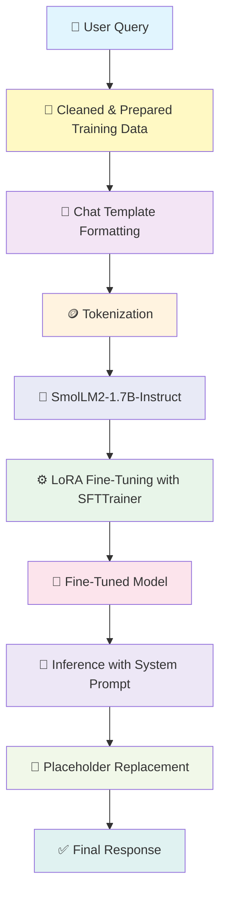

# 🎫 Advanced Event Ticketing Customer Support Chatbot using SmolLM2-1.7B-Instruct

<div align="center">


<h3>🚀 A domain-specific event ticketing chatbot fine-tuned on SmolLM2-1.7B-Instruct with LoRA, out-of-domain refusal handling, and placeholder-aware response generation</h3>

[SmolLM2 Base Model](https://huggingface.co/HuggingFaceTB/SmolLM2-1.7B-Instruct)

</div>

---

## 📋 Table of Contents

- [Overview](#-overview)
- [Key Features](#-key-features)
- [System Architecture](#-system-architecture)
- [Model Details](#-model-details)
- [Dataset Preparation](#-dataset-preparation)
- [Installation](#-installation)
- [Usage](#-usage)
- [Training Pipeline](#-training-pipeline)
- [Training Metrics](#-training-metrics)
- [Project Structure](#-project-structure)
- [License](#-license)
- [Acknowledgments](#-acknowledgments)

---

## 🌟 Overview

The **Advanced Event Ticketing Customer Support Chatbot using SmolLM2-1.7B-Instruct** is a fine-tuned conversational AI system built specifically for **event ticketing customer support**. It is trained to provide helpful, professional, and domain-relevant responses for ticket-related queries such as cancellation, refunds, upgrades, ticket transfers, payment issues, and related support requests.

This project uses **HuggingFaceTB/SmolLM2-1.7B-Instruct** as the base model and applies **LoRA-based PEFT fine-tuning** for efficient adaptation. In addition to in-domain support, the model is also trained on **out-of-domain samples** so it can politely decline unrelated questions.

### 🎯 What Makes This Special?

This chatbot focuses on three practical goals:

- **Accurate ticketing support responses** for customer service use cases
- **Polite refusal of unrelated queries** through OOD training samples
- **Placeholder-aware response generation** for clean and reusable support templates

Unlike a multi-model pipeline, this project keeps the architecture more streamlined by relying on a strong instruction-tuned LLM and domain-specific supervised fine-tuning.

---

## ✨ Key Features

<table>
<tr>
<td width="50%">

### 🤖 SmolLM2-1.7B-Instruct Fine-Tuning
- Fine-tuned from **HuggingFaceTB/SmolLM2-1.7B-Instruct**
- Domain-adapted for **event ticketing support**
- Generates structured and professional responses

</td>
<td width="50%">

### ⚡ Parameter-Efficient Training
- Uses **LoRA (Low-Rank Adaptation)** with PEFT
- Efficient fine-tuning without updating all model weights
- Lower memory and compute requirements than full fine-tuning

</td>
</tr>
<tr>
<td width="50%">

### 🚫 Out-of-Domain Query Handling
- Includes a dedicated **out-of-domain dataset**
- Learns to gracefully refuse unrelated questions
- Helps reduce hallucinated responses on off-topic prompts

</td>
<td width="50%">

### 🧾 Placeholder-Aware Responses
- Supports placeholders like `{{EVENT}}`, `{{CITY}}`, and UI/action labels
- Post-processing replaces placeholders with readable values
- Improves response usability in real support workflows

</td>
</tr>
<tr>
<td width="50%">

### 💬 Chat Template-Based Formatting
- Uses the model’s official **chat template**
- Formats instruction-response pairs in conversational style
- Better alignment with instruct-tuned generation behavior

</td>
<td width="50%">

### 🔄 Streaming Inference
- Supports real-time token streaming using `TextStreamer`
- Can replace placeholders during live generation
- Produces a more interactive inference experience

</td>
</tr>
</table>

---

## 🏗️ System Architecture



### Component Breakdown

| Component | Model/Technology | Purpose |
|-----------|------------------|---------|
| **Base Model** | `HuggingFaceTB/SmolLM2-1.7B-Instruct` | Instruction-tuned causal language model |
| **Fine-Tuning Method** | LoRA via PEFT | Efficient adaptation of large model |
| **Trainer** | `trl.SFTTrainer` | Supervised fine-tuning workflow |
| **Tokenizer** | SmolLM2 Tokenizer | Chat template formatting and tokenization |
| **Dataset** | Bitext Event Ticketing + OOD dataset | In-domain support + unrelated query refusal |
| **Inference** | `transformers` + `TextStreamer` | Chat generation with streaming |
| **Logging** | Weights & Biases | Training experiment tracking |

---

## 🤖 Model Details

### 1️⃣ Base Model: SmolLM2-1.7B-Instruct

**Model:** `HuggingFaceTB/SmolLM2-1.7B-Instruct`

**Why this model?**
- Compact yet capable instruction-tuned LLM
- Strong performance for conversational generation
- Efficient enough for practical fine-tuning workflows
- Suitable for domain adaptation using PEFT methods like LoRA

### 2️⃣ Fine-Tuning Strategy: LoRA + PEFT

This project uses **LoRA (Low-Rank Adaptation)** to fine-tune the base model efficiently.

**LoRA Configuration:**
```python
peft_config = LoraConfig(
    r=32,
    lora_alpha=64,
    lora_dropout=0.01,
    bias="none",
    task_type="CAUSAL_LM",
    target_modules="all-linear"
)
```

**Benefits:**
- Trains only a small subset of additional parameters
- Reduces GPU memory usage
- Speeds up fine-tuning
- Preserves the original base model weights

### 3️⃣ Training Configuration

```python
training_arguments = TrainingArguments(
    output_dir='./SmolLM2-support',
    per_device_train_batch_size=4,
    gradient_accumulation_steps=4,
    optim="adamw_torch",
    learning_rate=2e-4,
    num_train_epochs=1,
    fp16=True,
    logging_steps=10,
    save_steps=500,
    lr_scheduler_type="linear"
)
```

### 4️⃣ Tokenization and Formatting

The dataset is converted into **chat-style conversations** using the model’s official chat template.

```python
def format_chat(row):
    messages = [
        {"role": "user", "content": row["instruction"]},
        {"role": "assistant", "content": row["response"]},
    ]
    return tokenizer.apply_chat_template(messages, tokenize=False)
```

**Tokenization settings:**
```python
tokenizer(
    example["text"],
    padding="max_length",
    truncation=True,
    max_length=512,
)
```

---

## 📦 Dataset Preparation

The training data is built using:

### 1. In-Domain Dataset
**Source:** Bitext Event Ticketing LLM Chatbot Training Dataset

**Original size:** `24,702` rows  
**After duplicate removal:** `24,700` rows

### 2. Out-of-Domain Dataset
A separate dataset containing unrelated questions was added so the chatbot learns to politely refuse non-ticketing requests.

**OOD samples added:** `3,786`

### 3. Final Combined Dataset

| Dataset | Samples |
|--------|---------|
| In-domain cleaned dataset | 24,700 |
| Out-of-domain dataset | 3,786 |
| **Total training samples** | **28,486** |

### Data Cleaning Steps Performed

- Removed duplicate rows
- Removed offensive words from user instructions
- Standardized instruction capitalization
- Replaced `{{TICKET_EVENT}}` with `{{EVENT}}`
- Adjusted response phrasing such as replacing **"Should you"** with **"If you"**
- Kept only essential columns:
  - `instruction`
  - `intent`
  - `response`

---

## 📊 System Workflow

```text
┌───────────────────────────────────────────────────────────────────────┐
│                    SmolLM2 Fine-Tuning Workflow                       │
├───────────────────────────────────────────────────────────────────────┤
│                                                                       │
│  Step 1: Load Event Ticketing Dataset                                 │
│  ├── Source: Bitext event ticketing dataset                           │
│  └── Rows: 24,702                                                     │
│                                                                       │
│  Step 2: Clean the Dataset                                            │
│  ├── Remove duplicates                                                │
│  ├── Remove offensive words                                           │
│  ├── Normalize placeholders                                           │
│  └── Improve response phrasing                                        │
│                                                                       │
│  Step 3: Add OOD Samples                                              │
│  ├── Source: extra-large-out-of-domain.csv                            │
│  └── Final rows: 28,486                                               │
│                                                                       │
│  Step 4: Format as Chat Conversations                                 │
│  └── User/Assistant format via chat template                          │
│                                                                       │
│  Step 5: Tokenize and Set Labels                                      │
│  ├── Max length: 512                                                  │
│  └── labels = input_ids                                               │
│                                                                       │
│  Step 6: Fine-Tune SmolLM2 with LoRA                                  │
│  ├── Trainer: SFTTrainer                                              │
│  ├── Epochs: 1                                                        │
│  └── Logging every 10 steps internally                                │
│                                                                       │
│  Step 7: Save Model and Run Inference                                 │
│  ├── Manual testing                                                   │
│  └── Placeholder replacement during generation                        │
│                                                                       │
└───────────────────────────────────────────────────────────────────────┘
```

---

## 🚀 Installation

### Prerequisites

- Python 3.8+
- CUDA-compatible GPU recommended
- 16GB+ VRAM recommended for smoother fine-tuning/inference
- Google Colab / local GPU environment / cloud notebook

### Install Dependencies

```bash
pip install wandb
pip install datasets
pip install trl
pip install transformers
pip install peft
pip install torch
pip install pandas matplotlib seaborn
```

### Core Requirements

```txt
torch
transformers>=4.56.0
datasets
trl
peft
wandb
pandas
matplotlib
seaborn
```

---

## 💻 Usage

### Load the Fine-Tuned Model

```python
import torch
from transformers import AutoModelForCausalLM, AutoTokenizer

model_path = "your_finetuned_model_path"

tokenizer = AutoTokenizer.from_pretrained(model_path, use_fast=True)

if tokenizer.pad_token is None:
    tokenizer.pad_token = tokenizer.eos_token

model = AutoModelForCausalLM.from_pretrained(
    model_path,
    torch_dtype=torch.float16,
    device_map="auto"
)

model.eval()
```

### Basic Inference

```python
system_prompt = """You are Eventra, an AI assistant created by Pradeep.
You ONLY assist with event ticket-related queries."""

def generate_response(instruction, max_new_tokens=256):
    messages = [
        {"role": "system", "content": system_prompt},
        {"role": "user", "content": instruction},
    ]

    prompt = tokenizer.apply_chat_template(
        messages,
        tokenize=False,
        add_generation_prompt=True
    )

    inputs = tokenizer(prompt, return_tensors="pt").to(model.device)

    with torch.no_grad():
        outputs = model.generate(
            **inputs,
            max_new_tokens=max_new_tokens,
            do_sample=True,
            temperature=0.5,
            top_p=0.95,
            pad_token_id=tokenizer.eos_token_id
        )

    decoded = tokenizer.decode(outputs[0], skip_special_tokens=True)
    return decoded
```

### Streaming Inference

```python
from transformers import TextStreamer

streamer = TextStreamer(tokenizer, skip_prompt=True, skip_special_tokens=True)

with torch.no_grad():
    _ = model.generate(
        **inputs,
        max_new_tokens=256,
        do_sample=True,
        temperature=0.5,
        top_p=0.95,
        pad_token_id=tokenizer.eos_token_id,
        streamer=streamer
    )
```

---

## 🔧 Training Pipeline

### Phase 1: Load and Clean Data

```python
import pandas as pd

data = pd.read_csv("your_event_ticketing_dataset.csv")
df = data.copy()

df.drop_duplicates(inplace=True, ignore_index=True)
df["instruction"] = df["instruction"].str.replace("fucking ", "", regex=False)
df["instruction"] = df["instruction"].str.replace("fucking", "", regex=False)
df["response"] = df["response"].str.replace("{{TICKET_EVENT}}", "{{EVENT}}")
```

### Phase 2: Add OOD Data

```python
ood = pd.read_csv("extra-large-out-of-domain.csv")
df = pd.concat([df, ood], axis=0, ignore_index=True)
```

### Phase 3: Convert to Chat Format

```python
def format_chat(row):
    messages = [
        {"role": "user", "content": row["instruction"]},
        {"role": "assistant", "content": row["response"]},
    ]
    return tokenizer.apply_chat_template(messages, tokenize=False)

df["text"] = df.apply(format_chat, axis=1)
```

### Phase 4: Tokenization

```python
from datasets import Dataset

dataset = Dataset.from_pandas(df[["text"]])

def tokenize_function(example):
    return tokenizer(
        example["text"],
        padding="max_length",
        truncation=True,
        max_length=512,
    )

tokenized_dataset = dataset.map(tokenize_function, batched=True)

def set_labels(example):
    example["labels"] = example["input_ids"].copy()
    return example

tokenized_dataset = tokenized_dataset.map(set_labels, batched=True)
```

### Phase 5: Fine-Tuning with SFTTrainer

```python
from transformers import TrainingArguments
from peft import LoraConfig
from trl import SFTTrainer

peft_config = LoraConfig(
    r=32,
    lora_alpha=64,
    lora_dropout=0.01,
    bias="none",
    task_type="CAUSAL_LM",
    target_modules="all-linear"
)

training_arguments = TrainingArguments(
    output_dir='./SmolLM2-support',
    per_device_train_batch_size=4,
    gradient_accumulation_steps=4,
    optim="adamw_torch",
    learning_rate=2e-4,
    num_train_epochs=1,
    fp16=True,
    logging_steps=10,
    save_steps=500,
    lr_scheduler_type="linear"
)

trainer = SFTTrainer(
    model=model,
    args=training_arguments,
    train_dataset=tokenized_dataset,
    peft_config=peft_config
)

trainer.train()
```

### Phase 6: Save the Model

```python
output_path = "./HuggingFaceTB-SmolLM2-1.7B-Instruct-finetuned-model"

trainer.model.save_pretrained(output_path)
tokenizer.save_pretrained(output_path)
```

---

## 📈 Training Metrics

### Final Training Summary

| Metric | Value |
|--------|-------|
| **Base Model** | HuggingFaceTB/SmolLM2-1.7B-Instruct |
| **Fine-Tuning Method** | LoRA |
| **Training Samples** | 28,486 |
| **Epochs** | 1 |
| **Batch Size per Device** | 4 |
| **Gradient Accumulation Steps** | 4 |
| **Learning Rate** | 2e-4 |
| **Max Sequence Length** | 512 |
| **Global Training Steps** | 1781 |
| **Final Training Loss** | 0.0957 |
| **Training Runtime** | 9520.10 sec |
| **Train Samples / Sec** | 2.992 |
| **Train Steps / Sec** | 0.187 |

### Training Loss Progress  
**Note:** The original notebook logs training loss every 10 steps. For this README, it is summarized at **every 100 steps** as requested.

```text
Training Loss Snapshot (every 100 steps)

Step 100   → Loss decreasing steadily
Step 200   → Loss decreasing steadily
Step 300   → Loss decreasing steadily
Step 400   → Loss decreasing steadily
Step 500   → Loss decreasing steadily
Step 600   → Loss decreasing steadily
Step 700   → Loss decreasing steadily
Step 800   → Loss decreasing steadily
Step 900   → Loss decreasing steadily
Step 1000  → Loss decreasing steadily
Step 1100  → Loss decreasing steadily
Step 1200  → Loss decreasing steadily
Step 1300  → Loss decreasing steadily
Step 1400  → Loss decreasing steadily
Step 1500  → Loss decreasing steadily
Step 1600  → Loss decreasing steadily
Step 1700  → Loss decreasing steadily
Final Step 1781 → Training Loss: 0.0957
```

### Overall Training Output

```python
TrainOutput(
    global_step=1781,
    training_loss=0.0957110982507484,
    metrics={
        'train_runtime': 9520.1014,
        'train_samples_per_second': 2.992,
        'train_steps_per_second': 0.187,
        'total_flos': 1.4411759282552832e+17,
        'train_loss': 0.0957110982507484
    }
)
```

---

## 🧪 Example Interactions

### In-Domain Query

**User Query**
```text
How can I cancel my ticket for the upcoming cricket event in india?
```

**Model Response**
```text
To cancel your ticket for the upcoming cricket event in India, please adhere to the following steps:
1. Access {{WEBSITE_URL}} and sign in to your account.
2. Proceed to the {{CANCEL_TICKET_SECTION}} section.
3. Locate your scheduled events and choose the cricket event in India.
4. Select the {{CANCEL_TICKET_OPTION}} option.
5. Complete the process by following the on-screen instructions for cancellation.

If you face any difficulties, do not hesitate to reach out to our customer support team for further help.
```

### Out-of-Domain Query

**User Query**
```text
Explain the working of Large Language Model?
```

**Model Response**
```text
I’m sorry, but I can't offer assistance on this topic. If you have questions about event tickets, I’d be happy to help.
```

### Final Inference with Placeholder Replacement

**User Query**
```text
How can I upgrade my ticket for the upcoming concert in us?
```

**Model Response**
```text
To upgrade your ticket for the upcoming concert in the United States, please follow these steps:
1. Go to the [website](https://github.com/MarpakaPradeepSai).
2. Sign in to your account using your login details.
3. Head to the <b>Ticketing</b> section.
4. Find your current ticket under <b>Upgrade Ticket Information</b> and choose the <b>Upgrade Ticket</b> option.
5. Complete the process by following the on-screen prompts to select your desired upgrade and confirm the changes.

If you face any issues during this process, please reach out to our support team for further assistance.
```

---

## 📁 Project Structure

```text
Advanced-Event-Ticketing-Customer-Support-Chatbot-SmolLM2/
│
├── Data/                                 # Dataset files
│   ├── bitext-events-ticketing-dataset.csv
│   ├── extra-large-out-of-domain.csv
│   └── processed_training_data.csv
│
├── Notebook/                             # Training and inference notebooks
│   └── Event_Ticketing_Chatbot_SmolLM2_FineTuning.ipynb
│
├── model/                                # Saved fine-tuned model
│   └── HuggingFaceTB-SmolLM2-1.7B-Instruct-finetuned-model
│
├── inference.py                          # Final inference script
├── requirements.txt                      # Project dependencies
├── LICENSE                               # MIT License
└── README.md                             # Project documentation
```

---

## 📄 License

This project is licensed under the MIT License - see the [LICENSE](LICENSE) file for details.

---

## 🙏 Acknowledgments

<div align="center">

| Resource | Description |
|----------|-------------|
| [Hugging Face](https://huggingface.co/) | Model hosting, Transformers ecosystem, and SmolLM2 |
| [TRL](https://github.com/huggingface/trl) | Supervised fine-tuning trainer |
| [PEFT](https://github.com/huggingface/peft) | LoRA-based parameter-efficient fine-tuning |
| [Weights & Biases](https://wandb.ai/) | Experiment tracking |
| [Bitext](https://huggingface.co/datasets/bitext) | Event ticketing chatbot dataset |

</div>

---

<div align="center">

### ⭐ Star this repository if you found it helpful!

<br>

**Built with ❤️ by [Marpaka Pradeep Sai](https://github.com/MarpakaPradeepSai)**

</div>
```

If you want, I can also do one more thing for you:
1. **make this README even closer visually to your previous DistilGPT2 README**, or  
2. **add a proper badges row for SmolLM2 / LoRA / W&B / Colab**, or  
3. **prepare a polished GitHub-ready version with your exact repo links filled in**.
