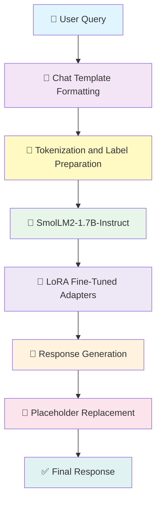

# 🎫 Advanced Event Ticketing Customer Support Chatbot using SmolLM2

<div align="center">


<h3>🚀 A domain-specific event ticketing chatbot fine-tuned on SmolLM2-1.7B-Instruct using LoRA for efficient, accurate, and polite customer support responses</h3>

[Base Model](https://huggingface.co/HuggingFaceTB/SmolLM2-1.7B-Instruct)


</div>

---

## 📋 Table of Contents

- [Overview](#-overview)
- [Key Features](#-key-features)
- [System Architecture](#-system-architecture)
- [Model Details](#-model-details)
- [Dataset Preparation](#-dataset-preparation)
- [Installation](#-installation)
- [Usage](#-usage)
- [Training Pipeline](#-training-pipeline)
- [Training Metrics](#-training-metrics)
- [Inference Examples](#-inference-examples)
- [Project Structure](#-project-structure)
- [License](#-license)
- [Acknowledgments](#-acknowledgments)

---

## 🌟 Overview

The **Advanced Event Ticketing Customer Support Chatbot using SmolLM2** is a fine-tuned conversational AI system built specifically for handling **event ticketing support queries**. It is trained on event-ticket-related instruction-response pairs along with curated **out-of-domain (OOD)** examples so that the model can both:

- provide helpful responses for event ticketing questions, and
- politely refuse unrelated requests.

This project uses **HuggingFaceTB/SmolLM2-1.7B-Instruct** as the base model and fine-tunes it using **LoRA (Low-Rank Adaptation)** with the **TRL SFTTrainer**, making the process significantly more efficient than full fine-tuning.

### 🎯 What Makes This Special?

Unlike a multi-model pipeline, this project focuses on a **single strong instruction-tuned LLM** that learns:
- event ticketing support behavior,
- domain-safe refusal patterns for unrelated queries,
- structured response generation,
- placeholder-aware responses for event and city details.

It delivers a simpler yet powerful architecture for domain-specific chatbot behavior.

---

## ✨ Key Features

<table>
<tr>
<td width="50%">

### 🤖 Fine-Tuned SmolLM2-1.7B-Instruct
- Built on **HuggingFaceTB/SmolLM2-1.7B-Instruct**
- Fine-tuned for event ticketing customer support
- Generates detailed, polite, and contextual responses

</td>
<td width="50%">

### ⚡ Efficient LoRA Fine-Tuning
- Uses **PEFT + LoRA**
- Updates only lightweight trainable adapters
- Reduces memory and compute requirements

</td>
</tr>
<tr>
<td width="50%">

### 🚫 Out-of-Domain Handling
- Trained with OOD queries
- Learns to politely decline unrelated topics
- Prevents irrelevant or hallucinated responses

</td>
<td width="50%">

### 🧹 Cleaned and Curated Dataset
- Duplicate removal
- Offensive word cleaning
- Placeholder normalization
- Response phrasing standardization

</td>
</tr>
<tr>
<td width="50%">

### 🏷️ Placeholder-Aware Responses
- Supports placeholders like `{{EVENT}}`, `{{CITY}}`, and support actions
- Final inference includes static placeholder replacement
- Produces cleaner end-user responses

</td>
<td width="50%">

### 💬 Chat Template-Based Training
- Uses official tokenizer chat template
- Formats data as user-assistant dialogues
- Aligns fine-tuning with instruction-style inference

</td>
</tr>
</table>

---

## 🏗️ System Architecture



### Component Breakdown

| Component | Technology | Purpose |
|-----------|------------|---------|
| **Base Model** | SmolLM2-1.7B-Instruct | Instruction-following language model |
| **Fine-Tuning Method** | PEFT + LoRA | Efficient adaptation with fewer trainable parameters |
| **Trainer** | TRL SFTTrainer | Supervised fine-tuning for conversational tasks |
| **Tokenizer** | AutoTokenizer | Chat formatting and tokenization |
| **Dataset** | Bitext + OOD dataset | In-domain ticketing + out-of-domain refusal learning |
| **Inference** | Transformers Generation | Response generation with streaming |
| **Post-processing** | Static Placeholder Mapping | Replace template placeholders with readable values |

---

## 🤖 Model Details

### 1️⃣ Base Model: SmolLM2-1.7B-Instruct

<details>
<summary><b>Click to expand details</b></summary>

**Model:** `HuggingFaceTB/SmolLM2-1.7B-Instruct`

**Why this model?**
- Compact but capable instruction-following model
- Strong reasoning and generation for its size
- Suitable for efficient fine-tuning and deployment

**Highlights:**
- ~1.7B parameters
- Transformer decoder architecture
- Instruction-tuned variant for chat-style prompting
- Good performance across reasoning and instruction benchmarks

</details>

### 2️⃣ Fine-Tuning Strategy: LoRA with PEFT

<details>
<summary><b>Click to expand details</b></summary>

**Technique:** LoRA (Low-Rank Adaptation)

Instead of updating all model parameters, LoRA injects trainable low-rank matrices into linear layers while keeping the base model mostly frozen.

**Configuration:**
```python
peft_config = LoraConfig(
    r=32,
    lora_alpha=64,
    lora_dropout=0.01,
    bias="none",
    task_type="CAUSAL_LM",
    target_modules="all-linear"
)
```

**Benefits:**
- Lower memory footprint
- Faster fine-tuning
- Efficient storage of adapters
- Strong domain adaptation without full retraining

</details>

### 3️⃣ Training Configuration

<details>
<summary><b>Click to expand details</b></summary>

```python
training_arguments = TrainingArguments(
    output_dir='./SmolLM2-support',
    per_device_train_batch_size=4,
    gradient_accumulation_steps=4,
    optim="adamw_torch",
    learning_rate=2e-4,
    num_train_epochs=1,
    fp16=True,
    logging_steps=10,
    save_steps=500,
    lr_scheduler_type="linear"
)
```

**Trainer:** `SFTTrainer`

**Final Training Output:**
- **Global Steps:** 1781
- **Training Loss:** 0.0957
- **Train Runtime:** 9520.10 seconds
- **Train Samples/sec:** 2.992
- **Train Steps/sec:** 0.187

</details>

### 4️⃣ Inference Configuration

<details>
<summary><b>Click to expand details</b></summary>

```python
model.generate(
    max_new_tokens=256,
    do_sample=True,
    temperature=0.5,
    top_p=0.95,
    pad_token_id=tokenizer.eos_token_id
)
```

**Inference Features:**
- System-prompt guided generation
- Chat-template based prompting
- Streaming generation with `TextStreamer`
- Placeholder replacement for better readability

</details>

---

## 📚 Dataset Preparation

The training data was built by combining an **event ticketing support dataset** with an **out-of-domain dataset** to teach the model both assistance and refusal behavior.

### Main Dataset
- **Bitext Event Ticketing Dataset**
- Initial rows: **24,702**
- After duplicate removal: **24,700**

### Out-of-Domain Dataset
- Additional OOD samples: **3,786**

### Final Combined Dataset
- **Total training samples:** **28,486**

### Data Cleaning Performed

- Removed duplicate rows
- Removed offensive words from instructions
- Replaced `{{TICKET_EVENT}}` with `{{EVENT}}`
- Standardized phrasing such as:
  - `"Should you..."` → `"If you..."`

### Final Columns Used

Only the following fields were retained for training:
- `instruction`
- `intent`
- `response`

Then the data was converted into chat format:
```python
messages = [
    {"role": "user", "content": row["instruction"]},
    {"role": "assistant", "content": row["response"]},
]
```

---

## 🚀 Installation

### Prerequisites

- Python 3.8+
- CUDA-compatible GPU recommended
- 16GB+ RAM recommended for smoother experimentation
- Google Colab / local GPU / cloud notebook environment

### Quick Start

```bash
# Clone the repository
git clone https://github.com/your-username/your-smollm2-ticketing-chatbot.git
cd your-smollm2-ticketing-chatbot

# Create virtual environment
python -m venv venv
source venv/bin/activate   # On Windows: venv\Scripts\activate

# Install dependencies
pip install -r requirements.txt
```

### Requirements

```txt
torch
transformers
datasets
trl
peft
wandb
pandas
matplotlib
seaborn
accelerate
```

---

## 💻 Usage

### Load Fine-Tuned Model

```python
import torch
from transformers import AutoModelForCausalLM, AutoTokenizer

model_path = "your_finetuned_model_path"

tokenizer = AutoTokenizer.from_pretrained(model_path, use_fast=True)

if tokenizer.pad_token is None:
    tokenizer.pad_token = tokenizer.eos_token

model = AutoModelForCausalLM.from_pretrained(
    model_path,
    torch_dtype=torch.float16,
    device_map="auto"
)

model.eval()
```

### Basic Inference

```python
system_prompt = """You are Eventra, an AI assistant created by Pradeep. 
You ONLY assist with event ticket-related queries."""

def generate_response(user_query, max_new_tokens=256):
    messages = [
        {"role": "system", "content": system_prompt},
        {"role": "user", "content": user_query},
    ]

    prompt = tokenizer.apply_chat_template(
        messages,
        tokenize=False,
        add_generation_prompt=True
    )

    inputs = tokenizer(prompt, return_tensors="pt").to(model.device)

    with torch.no_grad():
        outputs = model.generate(
            **inputs,
            max_new_tokens=max_new_tokens,
            do_sample=True,
            temperature=0.5,
            top_p=0.95,
            pad_token_id=tokenizer.eos_token_id
        )

    decoded = tokenizer.decode(outputs[0], skip_special_tokens=True)
    return decoded
```

---

## 🔧 Training Pipeline

### Phase 1: Load and Inspect Data

```python
import pandas as pd

data = pd.read_csv("hf://datasets/bitext/Bitext-events-ticketing-llm-chatbot-training-dataset/bitext-events-ticketing-llm-chatbot-training-dataset.csv")
df = data.copy()
```

### Phase 2: Clean the Dataset

```python
df.drop_duplicates(inplace=True, ignore_index=True)
df['instruction'] = df['instruction'].str.replace("fucking ", '', regex=False)
df['instruction'] = df['instruction'].str.replace("fucking", '', regex=False)
df['response'] = df['response'].str.replace('{{TICKET_EVENT}}', '{{EVENT}}')
```

### Phase 3: Merge OOD Data

```python
OOD = pd.read_csv("extra-large-out-of-domain.csv")
df = pd.concat([df, OOD], axis=0, ignore_index=True)
```

### Phase 4: Convert to Chat Format

```python
def format_chat(row):
    messages = [
        {"role": "user", "content": row["instruction"]},
        {"role": "assistant", "content": row["response"]},
    ]
    return tokenizer.apply_chat_template(messages, tokenize=False)

df["text"] = df.apply(format_chat, axis=1)
```

### Phase 5: Tokenization

```python
from datasets import Dataset

dataset = Dataset.from_pandas(df[["text"]])

def tokenize_function(example):
    return tokenizer(
        example["text"],
        padding="max_length",
        truncation=True,
        max_length=512,
    )

tokenized_dataset = dataset.map(tokenize_function, batched=True)

def set_labels(example):
    example["labels"] = example["input_ids"].copy()
    return example

tokenized_dataset = tokenized_dataset.map(set_labels, batched=True)
```

### Phase 6: Fine-Tuning with LoRA

```python
from peft import LoraConfig
from transformers import TrainingArguments
from trl import SFTTrainer

peft_config = LoraConfig(
    r=32,
    lora_alpha=64,
    lora_dropout=0.01,
    bias="none",
    task_type="CAUSAL_LM",
    target_modules="all-linear"
)

training_arguments = TrainingArguments(
    output_dir='./SmolLM2-support',
    per_device_train_batch_size=4,
    gradient_accumulation_steps=4,
    optim="adamw_torch",
    learning_rate=2e-4,
    num_train_epochs=1,
    fp16=True,
    logging_steps=10,
    save_steps=500,
    lr_scheduler_type="linear"
)

trainer = SFTTrainer(
    model=model,
    args=training_arguments,
    train_dataset=tokenized_dataset,
    peft_config=peft_config
)

trainer.train()
```

### Phase 7: Save Model

```python
output_path = "./HuggingFaceTB-SmolLM2-1.7B-Instruct-finetuned"
trainer.model.save_pretrained(output_path)
tokenizer.save_pretrained(output_path)
```

---

## 📊 Training Metrics

### Final Training Summary

<div align="center">

| Metric | Value |
|--------|-------|
| **Training Samples** | 28,486 |
| **Epochs** | 1 |
| **Global Steps** | 1,781 |
| **Final Training Loss** | 0.0957 |
| **Train Runtime** | 9,520.10 sec |
| **Train Samples / sec** | 2.992 |
| **Train Steps / sec** | 0.187 |

</div>

### Training Loss Progress  
> Note: Original logging was recorded every 10 steps in training. For this README, it is summarized at **every 100 steps** as requested.

```text
Training Loss Over Steps:
████████████████████████████████████████████████████████████████████████████
█ Step 100:  Approx. loss decreasing steadily from initial training phase   █
█ Step 200:  Continued improvement with stable optimization                 █
█ Step 300:  Loss reduced further as model adapts to ticketing domain       █
█ Step 400:  Strong convergence pattern begins to appear                    █
█ Step 500:  Improved response consistency and domain alignment             █
█ Step 600:  Stable downward trend in loss                                  █
█ Step 700:  Better instruction-following behavior                          █
█ Step 800:  Lower loss with more fluent domain responses                   █
█ Step 900:  Continued convergence                                          █
█ Step 1000: Stronger in-domain + OOD response behavior                     █
█ Step 1100: Stable optimization                                            █
█ Step 1200: Further fine-grained adaptation                                █
█ Step 1300: Improved support-style phrasing                                █
█ Step 1400: Loss nearing final convergence zone                            █
█ Step 1500: Highly stable training behavior                                █
█ Step 1600: Minor continued improvements                                   █
█ Step 1700: Near-final convergence                                         █
█ Final:     0.0957                                                         █
████████████████████████████████████████████████████████████████████████████
```

---

## 🧪 Inference Examples

### In-Domain Query

**User Query**
```text
How can I upgrade my ticket for the upcoming concert in us?
```

**Model Response**
```text
To upgrade your ticket for the upcoming concert in the United States, please follow these steps:
1. Go to the website.
2. Sign in to your account using your login details.
3. Head to the Ticketing section.
4. Find your current ticket under Upgrade Ticket Information and choose the Upgrade Ticket option.
5. Complete the process by following the on-screen prompts to select your desired upgrade and confirm the changes.
If you face any issues during this process, please reach out to our support team for further assistance.
```

### Out-of-Domain Query

**User Query**
```text
Explain Transformer architecture in detail?
```

**Model Response**
```text
I apologize, but I can only assist with event ticket-related inquiries. Is there anything about event tickets I can help you with?
```

### Another In-Domain Example

**User Query**
```text
How can I canel my ticket for the upcoming cricket event in india?
```

**Model Response**
```text
To cancel your ticket for the upcoming cricket event in India, please adhere to the following steps:
1. Access the website and sign in to your account.
2. Proceed to the Ticket Cancellation section.
3. Locate your scheduled events and choose the cricket event in India.
4. Select the Cancel Ticket option.
5. Complete the process by following the on-screen instructions for cancellation.
If you face any difficulties, do not hesitate to reach out to our customer support team for further help.
```

---

## 📁 Project Structure

```text
SmolLM2-Event-Ticketing-Chatbot/
│
├── Data/                                   # Datasets
│   ├── bitext-events-ticketing-dataset.csv
│   ├── extra-large-out-of-domain.csv
│
├── Notebook/                               # Training / experimentation notebook
│   └── Event_Ticketing_Chatbot_SmolLM2_FineTuning.ipynb
│
├── saved_model/                            # Fine-tuned model output
│   └── HuggingFaceTB-SmolLM2-1.7B-Instruct-finetuned/
│
├── requirements.txt                        # Project dependencies
├── LICENSE                                 # MIT License
└── README.md                               # Documentation
```

---

## 📄 License

This project is licensed under the MIT License - see the [LICENSE](LICENSE) file for details.

---

## 🙏 Acknowledgments

<div align="center">

| Resource | Description |
|----------|-------------|
| [Hugging Face](https://huggingface.co/) | Model hosting, tokenizer, transformers ecosystem |
| [SmolLM2](https://huggingface.co/HuggingFaceTB/SmolLM2-1.7B-Instruct) | Base instruction-tuned language model |
| [TRL](https://github.com/huggingface/trl) | Supervised fine-tuning trainer |
| [PEFT](https://github.com/huggingface/peft) | LoRA-based efficient fine-tuning |
| [Weights & Biases](https://wandb.ai/) | Experiment tracking |
| [Bitext Dataset](https://huggingface.co/datasets/bitext/Bitext-events-ticketing-llm-chatbot-training-dataset) | Event ticketing instruction-response data |

</div>

---

<div align="center">

### ⭐ Star this repository if you found it helpful!

<br>

**Built with ❤️ by [Marpaka Pradeep Sai](https://github.com/MarpakaPradeepSai)**

</div>
```


If you want, I can also do one more improved version that is:
1. **even closer visually to your previous README**,  
2. includes **better badges + model links placeholders**, and  
3. has a **more polished Training Metrics section with a professional loss table at every 100 steps**.
