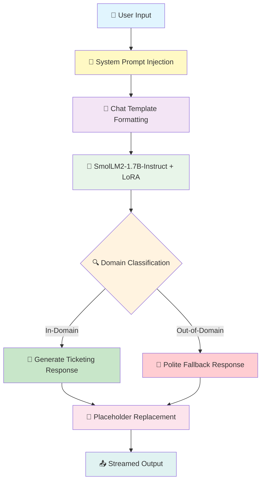

# 🎫 Eventra: Event Ticketing Chatbot - Fine-tuned SmolLM2-1.7B-Instruct

<div align="center">


<h3>🚀 A domain-specific event ticketing chatbot powered by LoRA fine-tuned SmolLM2-1.7B-Instruct with efficient parameter adaptation and intelligent out-of-domain query handling</h3>

[Fine-tuned Model](https://huggingface.co/YOUR_USERNAME/SmolLM2-1.7B-Instruct-EventTicketing) • [Base Model](https://huggingface.co/HuggingFaceTB/SmolLM2-1.7B-Instruct) • [Dataset](https://huggingface.co/datasets/bitext/Bitext-events-ticketing-llm-chatbot-training-dataset)


</div>

---

## 📋 Table of Contents

- [Overview](#-overview)
- [Key Features](#-key-features)
- [System Architecture](#-system-architecture)
- [Model Details](#-model-details)
- [Fine-tuning Approach](#-fine-tuning-approach)
- [Installation](#-installation)
- [Usage](#-usage)
- [Training Pipeline](#-training-pipeline)
- [Data Processing](#-data-processing)
- [Demo](#-demo)
- [Project Structure](#-project-structure)
- [License](#-license)
- [Acknowledgments](#-acknowledgments)

---

## 🌟 Overview

**Eventra** is an intelligent AI-powered event ticketing customer support chatbot built by fine-tuning the **SmolLM2-1.7B-Instruct** model using **LoRA (Low-Rank Adaptation)**. This chatbot is designed to handle customer inquiries related to event ticketing while gracefully declining out-of-domain queries.

### 🎯 What Makes This Special?

This project demonstrates efficient fine-tuning of a compact yet powerful 1.7B parameter model using parameter-efficient techniques. By leveraging LoRA, we achieve domain specialization with minimal computational overhead while maintaining the model's general capabilities. The chatbot includes robust out-of-domain detection and dynamic placeholder replacement for personalized responses.

---

## ✨ Key Features

<table>
<tr>
<td width="50%">

### 🧠 Parameter-Efficient Fine-tuning
- **LoRA-based adaptation** with rank 32
- Only **~0.5% of parameters** updated during training
- Preserves base model knowledge while adding domain expertise

</td>
<td width="50%">

### 💬 Natural Response Generation
- **Fine-tuned SmolLM2-1.7B-Instruct** for domain-specific responses
- Streaming text generation for real-time interaction
- Professional, context-aware replies

</td>
</tr>
<tr>
<td width="50%">

### 🚫 Out-of-Domain Handling
- **Trained on OOD samples** for graceful fallback
- Polite decline for non-ticketing queries
- Maintains focus on event ticketing domain

</td>
<td width="50%">

### 🔄 Dynamic Placeholder Replacement
- **60+ static placeholders** for consistent formatting
- Live replacement during streaming
- Support for events, cities, UI elements, and more

</td>
</tr>
<tr>
<td width="50%">

### 📝 Comprehensive Data Cleaning
- **Duplicate removal** for data quality
- **Offensive word filtering** for safe responses
- **Response phrasing adjustments** for consistency

</td>
<td width="50%">

### ⚡ Efficient Inference
- **FP16 precision** for faster inference
- **Streaming output** with TextStreamer
- Configurable generation parameters

</td>
</tr>
</table>

---

## 🏗️ System Architecture



### Component Breakdown

| Component | Technology | Purpose |
|-----------|------------|---------|
| **Base Model** | SmolLM2-1.7B-Instruct | Foundation language model |
| **Fine-tuning** | LoRA (PEFT) | Parameter-efficient adaptation |
| **Training** | SFTTrainer (TRL) | Supervised fine-tuning |
| **Inference** | TextStreamer | Real-time streaming output |
| **Logging** | Weights & Biases | Training experiment tracking |
| **Precision** | FP16 | Memory-efficient training/inference |

---

## 🤖 Model Details

### SmolLM2-1.7B-Instruct

<details>
<summary><b>Click to expand model specifications</b></summary>

**Architecture:** Transformer decoder trained in bfloat16 precision

**Training Data:** ~11 trillion tokens from diverse sources:
- FineWeb-Edu
- DCLM
- The Stack
- FineMath
- Stack-Edu
- SmolTalk

**Instruction Tuning:** 
- Supervised Fine-tuning (SFT)
- Direct Preference Optimization (DPO)
- UltraFeedback

**Benchmark Performance:**

| Task | SmolLM2-1.7B-Instruct | vs Llama-1B-Instruct |
|------|----------------------|----------------------|
| IFEval | 56.7 | 53.5 |
| MT-Bench | 6.13 | 5.48 |
| HellaSwag | 66.1 | 56.1 |
| ARC (avg) | 51.7 | 41.6 |
| PIQA | 74.4 | 72.3 |
| MMLU-Pro | 19.3 | 12.7 |
| GSM8K (5-shot) | 48.2 | 26.8 |

**Strengths:**
- Compact yet powerful
- Strong instruction-following capability
- Efficient on-device deployment
- Apache 2.0 license

</details>

### LoRA Configuration

<details>
<summary><b>Click to expand LoRA details</b></summary>

```python
LoraConfig(
    r=32,                         # LoRA rank (low-rank dimension)
    lora_alpha=64,                # Scaling factor for LoRA weights
    lora_dropout=0.01,            # Dropout for regularization
    bias="none",                  # Don't update bias terms
    task_type="CAUSAL_LM",        # For causal language modeling
    target_modules="all-linear"   # Apply LoRA to all linear layers
)
```

**Parameter Efficiency:**

| Component | Parameters |
|-----------|------------|
| Base Model | ~1.7B |
| LoRA Adapters | ~8.5M (0.5%) |
| Trainable | ~8.5M |
| Frozen | ~1.69B |

**Mathematical Foundation:**

Instead of updating full weight matrix W, LoRA decomposes the update:

$$\Delta W = A \cdot B$$

Where:
- $A \in \mathbb{R}^{d \times r}$ (rank-32 matrix)
- $B \in \mathbb{R}^{r \times k}$ (rank-32 matrix)
- Final weight: $W' = W + \alpha \cdot A \cdot B$

</details>

---

## 🔧 Fine-tuning Approach

### Why LoRA?

<div align="center">

| Aspect | Full Fine-tuning | LoRA Fine-tuning |
|--------|-----------------|------------------|
| **Trainable Params** | 1.7B (100%) | ~8.5M (0.5%) |
| **GPU Memory** | High | Low |
| **Training Time** | Hours | Minutes |
| **Storage** | ~7GB per checkpoint | ~35MB per adapter |
| **Base Model** | Modified | Frozen |

</div>

### Training Configuration

```python
TrainingArguments(
    output_dir='./SmolLM2-support',
    per_device_train_batch_size=4,
    gradient_accumulation_steps=4,    # Effective batch size: 16
    optim="adamw_torch",
    learning_rate=2e-4,
    num_train_epochs=1,
    fp16=True,
    logging_steps=10,
    save_steps=500,
    lr_scheduler_type="linear"
)
```

---

## 📊 Data Processing

### Dataset Overview

| Dataset | Samples | Purpose |
|---------|---------|---------|
| **Bitext Event Ticketing** | ~27,000+ | Domain-specific QA pairs |
| **Out-of-Domain Samples** | ~3,000+ | OOD query handling |
| **Total Training** | ~30,000+ | Combined dataset |

### Data Cleaning Pipeline

```
┌─────────────────────────────────────────────────────────────────────────┐
│                     Data Cleaning Pipeline                               │
├─────────────────────────────────────────────────────────────────────────┤
│                                                                         │
│  Step 1: Remove Duplicates                                              │
│  ├── Before: Original dataset size                                      │
│  └── After:  Unique samples only                                        │
│                                                                         │
│  Step 2: Remove Offensive Words                                         │
│  ├── Pattern: "fucking " → ""                                           │
│  └── Capitalize first letter after removal                              │
│                                                                         │
│  Step 3: Standardize Placeholders                                       │
│  └── {{TICKET_EVENT}} → {{EVENT}}                                       │
│                                                                         │
│  Step 4: Adjust Response Phrasing                                       │
│  └── "Should you" → "If you" (in closing lines)                         │
│                                                                         │
│  Step 5: Concatenate OOD Samples                                        │
│  └── Add out-of-domain queries with fallback responses                  │
│                                                                         │
└─────────────────────────────────────────────────────────────────────────┘
```

### Chat Template Format

```python
def format_chat(row):
    messages = [
        {"role": "user", "content": row["instruction"]},
        {"role": "assistant", "content": row["response"]},
    ]
    return tokenizer.apply_chat_template(messages, tokenize=False)
```

---

## 🚀 Installation

### Prerequisites

- Python 3.8+
- CUDA-compatible GPU (recommended)
- 16GB+ GPU VRAM for training
- 8GB+ GPU VRAM for inference

### Quick Start

```bash
# Clone the repository
git clone https://github.com/MarpakaPradeepSai/Eventra-SmolLM2-EventTicketing.git
cd Eventra-SmolLM2-EventTicketing

# Create virtual environment
python -m venv venv
source venv/bin/activate  # On Windows: venv\Scripts\activate

# Install dependencies
pip install -r requirements.txt
```

### Requirements

```txt
torch>=2.0.0
transformers>=4.40.0
datasets>=2.14.0
peft>=0.10.0
trl>=0.8.0
wandb>=0.16.0
pandas>=2.0.0
matplotlib>=3.7.0
seaborn>=0.12.0
```

---

## 💻 Usage

### Training

```python
# Load model and tokenizer
from transformers import AutoModelForCausalLM, AutoTokenizer
from peft import LoraConfig
from trl import SFTTrainer

model_name = "HuggingFaceTB/SmolLM2-1.7B-Instruct"
model = AutoModelForCausalLM.from_pretrained(
    model_name,
    device_map="auto",
    torch_dtype=torch.float16
)
tokenizer = AutoTokenizer.from_pretrained(model_name, use_fast=True)

# Configure LoRA
peft_config = LoraConfig(
    r=32,
    lora_alpha=64,
    lora_dropout=0.01,
    bias="none",
    task_type="CAUSAL_LM",
    target_modules="all-linear"
)

# Train with SFTTrainer
trainer = SFTTrainer(
    model=model,
    args=training_arguments,
    train_dataset=tokenized_dataset,
    peft_config=peft_config
)
trainer.train()
```

### Inference

```python
import torch
from transformers import AutoModelForCausalLM, AutoTokenizer, TextStreamer

# Load fine-tuned model
model_path = "path/to/fine-tuned-model"
model = AutoModelForCausalLM.from_pretrained(
    model_path,
    torch_dtype=torch.float16,
    device_map="auto"
)
tokenizer = AutoTokenizer.from_pretrained(model_path, use_fast=True)
model.eval()

# System prompt
system_prompt = """You are Eventra, an AI assistant created by Pradeep. 
You ONLY assist with event ticket-related queries.
For non-ticket-related queries, respond with:
"I apologize, but I can only assist with event ticket-related queries. 
Is there anything about event tickets I can help you with?"
"""

# Streaming inference
def stream_response(instruction, max_new_tokens=256):
    messages = [
        {"role": "system", "content": system_prompt},
        {"role": "user", "content": instruction},
    ]
    
    prompt = tokenizer.apply_chat_template(
        messages, tokenize=False, add_generation_prompt=True
    )
    inputs = tokenizer(prompt, return_tensors="pt").to(model.device)
    streamer = TextStreamer(tokenizer, skip_prompt=True, skip_special_tokens=True)
    
    with torch.no_grad():
        model.generate(
            **inputs,
            max_new_tokens=max_new_tokens,
            do_sample=True,
            temperature=0.5,
            top_p=0.95,
            streamer=streamer
        )

# Example usage
stream_response("How can I cancel my ticket for the concert in London?")
```

### Example Interactions

<table>
<tr>
<th>User Query (In-Domain)</th>
<th>Bot Response</th>
</tr>
<tr>
<td>

```
How can I upgrade my ticket 
for the upcoming concert in US?
```

</td>
<td>

```
To upgrade your ticket for the concert in USA, 
please follow these steps:

1. Visit our website and log into your account.
2. Navigate to the Ticket Information section.
3. Select the concert from your upcoming events.
4. Click on the Upgrade Ticket option.
5. Choose your preferred upgrade and complete 
   the payment.

If you need further assistance, please don't 
hesitate to contact our support team.
```

</td>
</tr>
<tr>
<th>User Query (Out-of-Domain)</th>
<th>Bot Response</th>
</tr>
<tr>
<td>

```
Explain the working of 
Large Language Models?
```

</td>
<td>

```
I apologize, but I can only assist with 
event ticket-related queries. Is there 
anything about event tickets I can help 
you with?
```

</td>
</tr>
</table>

---

## 📈 Training Pipeline

### Phase 1: Data Preparation

```python
import pandas as pd
from datasets import Dataset

# Load and clean data
data = pd.read_csv("bitext-events-ticketing-dataset.csv")
df = data.copy()

# Remove duplicates
df.drop_duplicates(inplace=True, ignore_index=True)

# Clean offensive content
df['instruction'] = df['instruction'].str.replace("fucking ", '', regex=False)

# Standardize placeholders
df['response'] = df['response'].str.replace('{{TICKET_EVENT}}', '{{EVENT}}')

# Add OOD samples
OOD = pd.read_csv("extra-large-out-of-domain.csv")
df = pd.concat([df, OOD], axis=0, ignore_index=True)

# Convert to HuggingFace Dataset
dataset = Dataset.from_pandas(df[["text"]])
```

### Phase 2: Model Fine-tuning

```python
from transformers import TrainingArguments
from trl import SFTTrainer
from peft import LoraConfig

# LoRA configuration
peft_config = LoraConfig(
    r=32, lora_alpha=64, lora_dropout=0.01,
    bias="none", task_type="CAUSAL_LM",
    target_modules="all-linear"
)

# Training arguments
training_args = TrainingArguments(
    output_dir='./SmolLM2-support',
    per_device_train_batch_size=4,
    gradient_accumulation_steps=4,
    learning_rate=2e-4,
    num_train_epochs=1,
    fp16=True,
    logging_steps=10,
    lr_scheduler_type="linear"
)

# Initialize trainer
trainer = SFTTrainer(
    model=model,
    args=training_args,
    train_dataset=tokenized_dataset,
    peft_config=peft_config
)

# Start training
trainer.train()
```

### Phase 3: Model Saving

```python
# Save fine-tuned model and tokenizer
output_path = "./SmolLM2-EventTicketing-LoRA"
trainer.model.save_pretrained(output_path)
tokenizer.save_pretrained(output_path)
```

---

## 🎨 Placeholder System

### Static Placeholders

The model uses **60+ predefined placeholders** for consistent formatting:

```python
static_placeholders = {
    # URLs & Links
    "{{WEBSITE_URL}}": "[website](https://example.com)",
    "{{SUPPORT_TEAM_LINK}}": "[support team](https://example.com/support)",
    
    # UI Elements
    "{{CANCEL_TICKET_OPTION}}": "<b>Cancel Ticket</b>",
    "{{UPGRADE_TICKET_BUTTON}}": "<b>Upgrade Ticket</b>",
    "{{SAVE_BUTTON}}": "<b>Save</b>",
    
    # Sections
    "{{TICKET_SECTION}}": "<b>Ticketing</b>",
    "{{PAYMENT_SECTION}}": "<b>Payment</b>",
    "{{SUPPORT_SECTION}}": "<b>Support</b>",
    
    # Dynamic (Fallback)
    "{{CITY}}": "<b>city</b>",
    "{{EVENT}}": "<b>event</b>"
}
```

### Live Replacement During Streaming

```python
class LiveReplacingStreamer(TextStreamer):
    def on_finalized_text(self, text: str, stream_end: bool = False):
        for k, v in static_placeholders.items():
            text = text.replace(k, v)
        print(text, end="", flush=True)
```

---

## 🎬 Demo

### In-Domain Query Response

```
User: How can I cancel my ticket for the upcoming cricket event in India?

Eventra: To cancel your ticket for the cricket event in India, please follow 
these steps:

1. Log in to your account on our website.
2. Navigate to the Ticket Cancellation section.
3. Select the cricket event from your booked events.
4. Click on the Cancel Ticket option.
5. Confirm your cancellation.

If you need any further assistance, feel free to reach out to our 
support team.
```

### Out-of-Domain Query Response

```
User: Explain the Transformer architecture in detail?

Eventra: I apologize, but I can only assist with event ticket-related 
queries. Is there anything about event tickets I can help you with?
```

---

## 📁 Project Structure

```
Eventra-SmolLM2-EventTicketing/
│
├── Data/                                    # Dataset Repository
│   ├── bitext-events-ticketing-dataset.csv  # Main training dataset
│   └── extra-large-out-of-domain.csv        # OOD samples
│
├── Notebooks/                               # Training Notebooks
│   └── SmolLM2_Fine_tuning_Event_Ticketing.ipynb  # Main training notebook
│
├── Models/                                  # Saved Models
│   └── SmolLM2-1.7B-Instruct-finetuned/    # Fine-tuned LoRA adapters
│
├── requirements.txt                         # Project Dependencies
├── LICENSE                                  # MIT License
└── README.md                                # Documentation
```

---

## 📊 Visualization

### Category Distribution

The dataset contains samples across multiple event ticketing categories:

```
┌─────────────────────────────────────────────────────────────────────────┐
│                     Category Distribution                                │
├─────────────────────────────────────────────────────────────────────────┤
│  CANCELLATION_FEE     ████████████████████████████████  ~3000           │
│  REFUND               ████████████████████████████████  ~3000           │
│  PAYMENT              ████████████████████████████████  ~3000           │
│  SUPPORT              ████████████████████████████████  ~3000           │
│  TICKET_INFO          ████████████████████████████████  ~3000           │
│  ...                  ...                                               │
└─────────────────────────────────────────────────────────────────────────┘
```

### Intent Distribution

The dataset covers **27 unique intents** with balanced distribution:

- `cancel_ticket`
- `get_refund`
- `upgrade_ticket`
- `transfer_ticket`
- `find_upcoming_events`
- And 22 more...

---

## 📄 License

This project is licensed under the MIT License - see the [LICENSE](LICENSE) file for details.

---

## 🙏 Acknowledgments

<div align="center">

| Resource | Description |
|----------|-------------|
| [Hugging Face](https://huggingface.co/) | Transformers, PEFT, TRL libraries |
| [SmolLM2](https://huggingface.co/HuggingFaceTB/SmolLM2-1.7B-Instruct) | Base model |
| [Bitext](https://huggingface.co/datasets/bitext) | Event ticketing dataset |
| [Weights & Biases](https://wandb.ai/) | Experiment tracking |
| [Google Colab](https://colab.research.google.com/) | Training infrastructure |

</div>

---

<div align="center">

### ⭐ Star this repository if you found it helpful!

<br>

**Built with ❤️ by [Marpaka Pradeep Sai](https://github.com/MarpakaPradeepSai)**

*Powered by SmolLM2 🤖 + LoRA ⚡ + TRL 🎯*

</div>
